📍 [Documentation Hub](../README.md) > [Core Concepts](./README.md) > GitHub Copilot Workflow - Complete Process Flow

# GitHub Copilot Workflow - Complete Process Flow

**⚠️ MANDATORY: YOU MUST FOLLOW THIS EXACT WORKFLOW - NO EXCEPTIONS**

**⚠️ DO NOT SKIP VERIFICATION STEPS - RECHECK BEFORE COMPLETION**

This diagram illustrates the complete workflow that GitHub Copilot (or any AI assistant) MUST follow when working on this project.

## Critical Workflow Rules

1. **Follow this chart EXACTLY** - Each step is mandatory
2. **Never skip verification loops** - They prevent errors
3. **Always recheck before completion** - Verify work meets standards
4. **Validate implementation quality** - Don't assume it works
5. **Re-verify patterns after changes** - Ensure no violations introduced

## 🔄 Complete Workflow Diagram

```mermaid
flowchart TD
    Start(["👤 User Sends Request"]) --> LoadConcepts{"📚 Load Core Concepts"}
    LoadConcepts -- MANDATORY --> ReadCoreREADME["📖 Read docs/core-concepts/README.md"]
    ReadCoreREADME --> ReadAllConcepts["📖 Read ALL files in docs/core-concepts/"]
    ReadAllConcepts --> ConceptsLoaded{"✅ All Core Concepts<br>Loaded?"}
    ConceptsLoaded -- No --> ReadAllConcepts
    ConceptsLoaded -- Yes --> LoadDocs["📚 Documentation-First Workflow"]
    LoadDocs --> ReadDocsREADME["📖 Read docs/README.md"]
    ReadDocsREADME --> IdentifyRelevant["🔍 Identify Relevant Documentation"]
    IdentifyRelevant --> ParallelRead["⚡ Batch Read Documentation<br>SILENTLY"]
    ParallelRead -- Read in Parallel --> Concepts["docs/concepts/"] & Architecture["docs/architecture/"] & Features["docs/features/"] & Specs["docs/specifications/"]
    Concepts --> VerifyContext{"✅ Context Complete?"}
    Architecture --> VerifyContext
    Features --> VerifyContext
    Specs --> VerifyContext
    VerifyContext -- Missing Info --> BatchQuestions["❓ Batch ALL Questions<br>Single Request"]
    BatchQuestions --> WaitResponse["⏳ Wait for User Response"]
    WaitResponse --> VerifyContext
    VerifyContext -- Complete --> CreateTodoList{"📋 Complex Task?<br>Multiple Steps?"}
    CreateTodoList -- Yes --> WriteTodoList["📝 Create Todo List<br>Break Down Task"]
    CreateTodoList -- No --> CheckConflict{"⚠️ Check Core Concept<br>Conflicts"}
    WriteTodoList --> MarkInProgress["✏️ Mark Current Todo<br>as In-Progress"]
    MarkInProgress --> CheckConflict
    CheckConflict -- Conflict Detected --> RequestApproval["🚨 Request User Approval<br>Show Conflict Details"]
    RequestApproval --> UserDecision{"User Decision"}
    UserDecision -- Update Core Concept --> UpdateConcept["📝 Update Core Concept File"]
    UserDecision -- Follow Core Concept --> CheckPattern{"🔍 Verify Pattern Usage"}
    UserDecision -- Override --> ProceedAnyway["⚠️ Proceed with Override<br>Document Reason"]
    UpdateConcept --> UpdateConceptREADME["📝 Update core-concepts/README.md"]
    UpdateConceptREADME --> CheckPattern
    ProceedAnyway --> Implement["🛠️ Implement SILENTLY<br>No Announcements"]
    CheckConflict -- No Conflict --> CheckPattern
    CheckPattern -- "Service-Adapter?" --> VerifyServiceAdapter["✅ Repository → Service → Adapter"]
    CheckPattern -- Repository Access? --> VerifyRepoOwnership["✅ Service-to-Service Only"]
    CheckPattern -- Auth Operations? --> VerifyAuthService["✅ Use AuthService.api"]
    CheckPattern -- Core vs Feature? --> VerifyModuleLocation["✅ Correct Module Location"]
    CheckPattern -- Type Definition? --> VerifyTypeInference["✅ Prefer Type Inference"]
    CheckPattern -- File Deletion? --> VerifyFileManagement["✅ Request Permission First"]
    VerifyServiceAdapter --> Implement
    VerifyRepoOwnership --> Implement
    VerifyAuthService --> Implement
    VerifyModuleLocation --> Implement
    VerifyTypeInference --> Implement
    VerifyFileManagement --> Implement
    Implement --> ExecuteChanges["⚡ Execute All Changes"]
    ExecuteChanges --> VerifyImplementation{"🔍 Verify Implementation<br>Quality"}
    VerifyImplementation --> CheckCodeQuality["✅ Check Code Quality<br>Syntax, Logic, Completeness"]
    CheckCodeQuality --> CodeQualityOK{"Code Quality<br>Acceptable?"}
    CodeQualityOK -- No --> FixIssues["🔧 Fix Issues"]
    FixIssues --> VerifyImplementation
    CodeQualityOK -- Yes --> ReverifyPatterns{"🔍 Re-verify Patterns<br>After Changes"}
    ReverifyPatterns --> CheckPatternsAgain["✅ Verify No Pattern Violations<br>Introduced by Changes"]
    CheckPatternsAgain --> PatternsStillValid{"Patterns Still<br>Followed?"}
    PatternsStillValid -- No --> FixPatternViolations["🔧 Fix Pattern Violations"]
    FixPatternViolations --> ReverifyPatterns
    PatternsStillValid -- Yes --> CompleteTodo{"📋 Todo List<br>Exists?"}
    CompleteTodo -- Yes --> MarkComplete["✅ Mark Current Todo<br>as Completed"]
    CompleteTodo -- No --> PreCompletionVerification{"🔍 Pre-Completion<br>Verification"}
    MarkComplete --> MoreTodos{"More Todos?"}
    MoreTodos -- Yes --> NextTodo["📝 Mark Next Todo<br>as In-Progress"]
    MoreTodos -- No --> PreCompletionVerification
    NextTodo --> CheckPattern
    PreCompletionVerification --> RunFinalChecks["✅ Run Final Verification:<br>- All requirements met?<br>- No errors introduced?<br>- Patterns followed?<br>- Documentation complete?"]
    RunFinalChecks --> FinalChecksPassed{"All Checks<br>Passed?"}
    FinalChecksPassed -- No --> IdentifyIssues["🔍 Identify What Failed"]
    IdentifyIssues --> FixFinalIssues["🔧 Fix Identified Issues"]
    FixFinalIssues L_FixFinalIssues_PreCompletionVerification_0@--> VerifyContext
    FinalChecksPassed -- Yes --> ShowResults["📋 Show Completed Work"]
    ShowResults --> UpdateDocsCheck{"📝 Documentation<br>Needs Update?"}
    UpdateDocsCheck -- Yes --> ReadDocStructure["⚠️ MANDATORY: Read Documentation Structure<br>NEVER skip this step"]
    UpdateDocsCheck -- No --> ExplainCritical{"🔍 Critical Decision<br>Made?"}
    ReadDocStructure --> CheckSimilarDocs["� Read 2-3 Similar Documentation Files<br>Understand format, headers, sections, style"]
    CheckSimilarDocs --> UpdateDocs["📝 Update/Create Documentation<br>Following EXACT format from similar docs"]
    UpdateDocs --> UpdateParentREADME["📝 Update Parent README.md<br>Add/Update Reference"]
    UpdateParentREADME --> ValidateLinks["✅ Validate Links<br>check-doc-links.ts"]
    ValidateLinks --> LinksValid{"All Links<br>Valid?"}
    LinksValid -- No --> FixLinks["🔧 Fix Broken Links"]
    FixLinks --> ValidateLinks
    LinksValid -- Yes --> CheckMainREADME{"New Category or<br>Major Change?"}
    CheckMainREADME -- Yes --> UpdateMainREADME["📝 Update docs/README.md"]
    CheckMainREADME -- No --> ExplainCritical
    UpdateMainREADME --> ExplainCritical
    ExplainCritical -- Yes --> ExplainDecision["💡 Explain ONLY Critical Steps<br>Architecture, Security, Data"]
    ExplainCritical -- No --> Complete(["✅ Task Complete"])
    ExplainDecision --> Complete

    style Start stroke:#e1f5fe,stroke-width:6px
    style LoadConcepts stroke:#fff3e0,stroke-width:6px
    style ReadCoreREADME stroke:#fff9c4,stroke-width:6px
    style ReadAllConcepts stroke:#fff9c4,stroke-width:6px
    style ParallelRead stroke:#f3e5f5,stroke-width:6px
    style CheckConflict stroke:#ffebee,stroke-width:6px
    style RequestApproval stroke:#ffcdd2,stroke-width:6px
    style Implement stroke:#c8e6c9,stroke-width:6px
    style VerifyImplementation stroke:#ffe0b2,stroke-width:6px
    style ReverifyPatterns stroke:#ffe0b2,stroke-width:6px
    style PreCompletionVerification stroke:#ffccbc,stroke-width:6px
    style RunFinalChecks stroke:#ffccbc,stroke-width:6px
    style ReadDocStructure stroke:#ffebee,stroke-width:6px,fill:#fff3e0
    style CheckSimilarDocs stroke:#fff3e0,stroke-width:6px
    style Complete stroke:#a5d6a7,stroke-width:6px
```



## 📋 Workflow Phases Explained

### Phase 1: Core Concepts Loading (MANDATORY)
**🔴 CRITICAL - CANNOT BE SKIPPED**

1. **Read `docs/core-concepts/README.md`** - Get complete index
2. **Read ALL files in `docs/core-concepts/`** - Load every concept
3. **Verify all concepts loaded** - Ensure nothing missed

**Why This Matters:**
- Core concepts are NON-NEGOTIABLE rules
- They override all other documentation
- They define project patterns and processes
- Missing them leads to incorrect implementations

### Phase 2: Documentation-First Workflow
**⚡ SILENT EXECUTION - NO ANNOUNCEMENTS**

1. **Read `docs/README.md`** - Documentation hub (ALWAYS START HERE)
2. **Navigate via README structure** - Identify relevant subdirectories
3. **Check subdirectory READMEs** - Understand topic organization
4. **Batch read in parallel** - Read specific files silently and simultaneously
5. **Verify context complete** - Ensure all information gathered
6. **Create todo list (if complex)** - Break down multi-step tasks

**README-First Pattern** (See [06-README-FIRST-DOCUMENTATION-DISCOVERY.md](./06-README-FIRST-DOCUMENTATION-DISCOVERY.md)):
- ✅ ALWAYS read `docs/README.md` first
- ✅ Navigate via subdirectory structure (concepts/, architecture/, guides/, etc.)
- ✅ Check subdirectory READMEs before individual files
- ✅ Use `docs/bin/generate-doc-diagram.sh` to visualize documentation relationships
- ❌ NEVER jump directly to specific files without understanding structure

**Key Principle:**
- ❌ Never announce: "I'll read file X"
- ❌ Never jump directly to individual files
- ✅ Silently gather all context first via README hierarchy
- ✅ Only speak when asking batched questions
- ✅ Use todo list for complex tasks requiring multiple steps

### Phase 3: Todo List Management (For Complex Tasks)
**📋 TRACK PROGRESS AND MAINTAIN FOCUS**

**When to Create Todo List:**
- Task requires multiple distinct steps
- Complex multi-file changes needed
- User provides numbered/comma-separated tasks
- Breaking down larger feature into smaller units

**Todo List Workflow:**
1. **Create todo list** - Write all tasks with clear descriptions
2. **Mark in-progress** - ONE todo at a time before starting work
3. **Complete task** - Implement the specific todo item
4. **Mark completed** - Update status IMMEDIATELY after finishing
5. **Move to next** - Mark next todo as in-progress and repeat

**Todo States:**
- `not-started`: Todo not yet begun
- `in-progress`: Currently working (LIMIT ONE at a time)
- `completed`: Finished successfully

**Important Rules:**
- ✅ Mark todos completed as soon as done (don't batch completions)
- ✅ Only ONE todo in-progress at any time
- ✅ Update todo list frequently to show progress
- ❌ Don't create todo list for simple single-step tasks

### Phase 4: Conflict Detection
**⚠️ PROTECT CORE CONCEPTS**

1. **Check user request against core concepts**
2. **If conflict detected:**
   - Stop immediately
   - Show conflict details
   - Present options to user
   - Request approval for any override
3. **If no conflict:**
   - Proceed to pattern verification

**Conflict Resolution Options:**
1. Implement following core concept (recommended)
2. Update core concept (requires approval + rationale)
3. Override (requires explicit user approval)

### Phase 5: Pattern Verification
**✅ VALIDATE IMPLEMENTATION APPROACH**

Before implementing, verify:

- **Service-Adapter Pattern**: Repository → Service → Adapter flow
- **Repository Ownership**: Services access repositories, NOT other services
- **Auth Operations**: Use AuthService.api for all auth entities
- **Module Organization**: Core vs Feature architecture
- **Type Definitions**: Prefer inference over manual types
- **File Management**: Request permission before deletion

### Phase 6: Implementation
**🛠️ ACTION-ORIENTED EXECUTION**

1. **Implement silently** - No verbose explanations
2. **Execute all changes** - Use tools efficiently
3. **Verify implementation immediately** - Check code quality
4. **Re-verify patterns after changes** - Ensure no violations introduced
5. **Run pre-completion verification** - Final quality checks
6. **Update todo status** - Mark completed, move to next (if todo list exists)
7. **Show completed work** - Present results (only after verification passes)
8. **Update documentation** - If patterns change
9. **Explain critical decisions** - ONLY if architecture/security/data affected

**Communication Rules:**
- ❌ Don't explain standard operations
- ❌ Don't announce tool usage
- ❌ Don't skip verification steps
- ✅ Show completed work (after verification)
- ✅ Explain only critical architectural decisions
- ✅ Update todo list to show progress (if using todo list)
- ✅ Recheck quality before declaring complete

### Phase 6a: Post-Implementation Verification (NEW)
**🔍 IMMEDIATE QUALITY VERIFICATION**

**After executing changes, immediately verify:**

1. **Check Code Quality**
   - ✅ Syntax correctness
   - ✅ Logic completeness
   - ✅ No obvious errors
   - ✅ All requirements addressed
   - 🔄 If issues found: Fix and re-verify

2. **Re-verify Pattern Adherence**
   - ✅ Service-Adapter pattern still followed
   - ✅ Repository ownership respected
   - ✅ Auth operations use AuthService.api
   - ✅ Correct module location (core vs feature)
   - ✅ Type inference used appropriately
   - ✅ No unauthorized file deletions
   - 🔄 If violations found: Fix and re-verify

**Why This Phase Is Critical:**
- Implementation can introduce subtle pattern violations
- Changes might break existing architectural rules
- Early detection prevents cascading issues
- Quality must be verified, not assumed

**Loop Until Perfect:**
- This phase has built-in loops
- Don't proceed until all checks pass
- Fix issues immediately when detected
- Re-verify after each fix

### Phase 6b: Pre-Completion Verification (NEW)
**✅ FINAL SANITY CHECKS BEFORE SHOWING RESULTS**

**Before showing results to user, run comprehensive final verification:**

1. **Verify All Requirements Met**
   - ✅ Original user request fully addressed
   - ✅ All todo items completed (if todo list used)
   - ✅ No partial implementations
   - ✅ Edge cases considered

2. **Verify No Errors Introduced**
   - ✅ Code runs without errors
   - ✅ No breaking changes to existing functionality
   - ✅ All imports resolve correctly
   - ✅ No syntax or type errors

3. **Verify Patterns Still Followed**
   - ✅ All core concepts respected
   - ✅ Architectural patterns maintained
   - ✅ No shortcuts or violations introduced
   - ✅ Documentation updated if needed

4. **Verify Documentation Complete**
   - ✅ Code changes documented if significant
   - ✅ README files updated if structure changed
   - ✅ Links validated if documentation modified
   - ✅ No broken references

**Final Check Decision:**
- ✅ If ALL checks pass → Proceed to show results
- ❌ If ANY check fails → Identify issue, fix, and re-verify from start
- 🔄 Loop until all verifications pass

**Why This Phase Is Critical:**
- Last chance to catch issues before user sees result
- Prevents showing incomplete or broken implementations
- Ensures quality and completeness
- Validates work meets all standards

**DO NOT SKIP THIS PHASE** - It's the final quality gate

### Phase 7: Documentation Maintenance
**📝 SYSTEMATIC DOCUMENTATION UPDATES**

**When documentation needs updating:**

1. **Read Existing Documentation Structure FIRST** (MANDATORY - DO NOT SKIP)
   - ⚠️ **CRITICAL**: Never create documentation without first reading similar files
   - Check 2-3 similar documentation files to understand format
   - Review existing patterns and conventions (headers, sections, formatting)
   - Understand the established structure before creating new docs
   - Look at recently updated files in the same category
   - **Example**: If creating `guides/NEW-GUIDE.md`, read `guides/GETTING-STARTED.md` and `guides/DEVELOPMENT-WORKFLOW.md` first
   - **Why**: Ensures consistency, prevents duplicate content, follows project conventions

2. **Update or Create Documentation File**
   - Follow naming conventions and required sections from similar files
   - Use the EXACT same format as similar existing documentation
   - Ensure proper structure, metadata, and headers match existing docs
   - Match the tone, detail level, and style of related docs
   - Include same sections (Overview, Setup, Examples, Troubleshooting, etc.)

3. **Update parent README.md** (MANDATORY)
   - Add reference to new/changed file
   - Create parent README if it doesn't exist
   - Maintain proper index structure

4. **Validate links with check-doc-links.ts** (MANDATORY)
   ```bash
   bun run docs/bin/check-doc-links.ts --file docs/path/to/file.md --depth 2
   ```
   - Must show `Broken links: 0`
   - Fix broken links if found
   - Re-validate until clean

5. **Update docs/README.md** (if needed)
   - For new categories
   - For major structural changes
   - For new documentation types

**New Folder Protocol:**
- Create README.md in new folder with index
- Update parent README to reference new folder
- Validate links from parent
- Update docs/README.md with new category

**Link Validation Rules:**
- ✅ ALWAYS run check-doc-links.ts after documentation changes
- ✅ ALWAYS fix broken links before completing task
- ✅ ALWAYS validate parent README after updates
- ❌ NEVER leave documentation with broken links

**See**: [10-DOCUMENTATION-MAINTENANCE-PROTOCOL.md](./10-DOCUMENTATION-MAINTENANCE-PROTOCOL.md) for complete protocol.

## 🔑 Key Principles Summary

### 1. Core Concepts Are Sacred
- **ALWAYS** load at conversation start
- **NEVER** bypass without explicit override
- **ALWAYS** check for conflicts before implementing

### 2. Documentation-First
- **READ** docs/README.md FIRST (main hub)
- **NAVIGATE** via subdirectory structure
- **CHECK** subdirectory READMEs before individual files
- **BATCH** file reads (parallel, silent)
- **VERIFY** context complete before implementing
- **USE** `docs/bin/generate-doc-diagram.sh` to understand doc relationships

### 3. Todo List Management (Complex Tasks)
- **CREATE** todo list for multi-step tasks
- **ONE** todo in-progress at a time
- **MARK** completed immediately after finishing
- **TRACK** progress visibly for user

### 4. Efficient Execution
- **SILENT** context gathering
- **NO** announcements about reading/searching
- **BATCH** all questions into single request
- **EXPLAIN** only critical decisions

### 5. Pattern Enforcement
- **Service-Adapter** for all controllers
- **Repository Ownership** via domain services
- **AuthService.api** for all auth operations
- **Type Inference** over manual definitions

### 6. Verification Loops (NEW - MANDATORY)
- **VERIFY** implementation quality immediately after changes
- **RE-VERIFY** patterns after implementation
- **RUN** pre-completion verification before showing results
- **FIX** issues and re-verify in loops
- **NEVER** skip verification steps
- **NEVER** assume quality - verify it
- **Permission** before file deletion

### 6. Documentation Maintenance
- **Update parent README** for every doc change
- **Validate links** with check-doc-links.ts (MANDATORY)
- **Create README.md** for all new folders
- **Update docs/README.md** for new categories
- **Fix broken links** before completing work
- **Zero broken links** policy (strictly enforced)

## 📊 Decision Tree Reference

```
User Request
    ↓
Load Core Concepts (MANDATORY)
    ↓
Read Documentation (SILENT, PARALLEL)
    ↓
Complex Task? → YES → Create Todo List → Mark First In-Progress
               → NO  → Continue
    ↓
Check Conflict?
    ├── YES → Request Approval → User Decision
    │                              ├── Follow → Verify Patterns → Implement
    │                              ├── Update → Update Concept → Verify Patterns → Implement  
    │                              └── Override → Implement (document reason)
    └── NO → Verify Patterns → Implement
                                    ↓
                                Execute Changes
                                    ↓
                                ** NEW: Post-Implementation Verification **
                                    ↓
                                Check Code Quality → Quality OK? → NO → Fix Issues → Re-verify
                                                                 → YES → Continue
                                    ↓
                                Re-verify Patterns → Patterns Valid? → NO → Fix Violations → Re-verify
                                                                      → YES → Continue
                                    ↓
                                Todo List? → YES → Mark Completed → More Todos?
                                                                     ├── YES → Next Todo (In-Progress) → Loop to Verify Patterns
                                                                     └── NO → Pre-Completion Verification
                                           → NO → Pre-Completion Verification
                                    ↓
                                ** NEW: Pre-Completion Verification **
                                    ↓
                                Run Final Checks:
                                - All requirements met?
                                - No errors introduced?
                                - Patterns followed?
                                - Documentation complete?
                                    ↓
                                All Checks Passed? → NO → Identify Issues → Fix → Re-verify from start
                                                   → YES → Show Results
                                    ↓
                                Update Docs? → YES → Read Doc Structure
                                                     ↓
                                                     Check Similar Docs for Format
                                                     ↓
                                                     Update/Create Doc File
                                                     ↓
                                                     Update Parent README
                                                     ↓
                                                     Validate Links (check-doc-links.ts)
                                                     ↓
                                                     Links Valid? → NO → Fix Links → Validate Again
                                                                 → YES → Update docs/README.md (if needed)
                                           → NO → Continue
                                    ↓
                                Explain Critical (if needed)
                                    ↓
                                Complete
```

## 🎯 Success Criteria

A workflow is successful when:

✅ All core concepts loaded at start
✅ All relevant documentation read silently
✅ Todo list created for complex tasks (when needed)
✅ Todos marked in-progress/completed appropriately
✅ No core concept violations (or approved overrides)
✅ Correct patterns verified and applied
✅ Implementation completed without verbose explanations
✅ **NEW: Code quality verified immediately after implementation**
✅ **NEW: Patterns re-verified after changes to catch violations**
✅ **NEW: Pre-completion verification passed before showing results**
✅ Documentation updated if patterns changed
✅ **Parent README.md updated for doc changes**
✅ **Links validated with check-doc-links.ts (0 broken links)**
✅ **New folders have README.md with proper index**
✅ **docs/README.md updated for new categories**
✅ Critical decisions explained (when necessary)
✅ Todo list shows clear progress (if used)

## ⚠️ Common Pitfalls to Avoid

❌ **Starting implementation without loading core concepts**
❌ **Announcing every file read or tool usage**
❌ **Bypassing core concepts without checking for conflicts**
❌ **Explaining standard CRUD or refactoring operations**
❌ **Creating todo list for simple single-step tasks**
❌ **Having multiple todos in-progress simultaneously**
❌ **Forgetting to mark todos completed after finishing**
❌ **Directly accessing repositories from controllers**
❌ **Using direct database for auth operations**
❌ **Deleting files without explicit permission**
❌ **Manually defining types instead of inferring**
❌ **Creating documentation without updating parent README**
❌ **Leaving broken links in documentation**
❌ **Creating folders without README.md**
❌ **Skipping link validation after doc changes**
❌ **NEW: Skipping post-implementation quality verification**
❌ **NEW: Not re-verifying patterns after making changes**
❌ **NEW: Showing results before pre-completion verification**
❌ **NEW: Assuming quality without verification**
❌ **NEW: Proceeding to completion with failing checks**

## 🔄 Feedback Loop

After each task:
1. Verify implementation follows all core concepts
2. **NEW: Run post-implementation quality checks**
3. **NEW: Re-verify patterns after changes**
4. **NEW: Execute pre-completion verification**
5. Mark todo as completed (if using todo list)
6. Check if more todos remain (if using todo list)
7. Update documentation if new patterns discovered
8. **Update parent README.md for doc changes**
9. **Validate links with check-doc-links.ts**
10. **Fix any issues and re-verify before completion**

## 🚨 CRITICAL REMINDERS

**FOLLOW THIS WORKFLOW EXACTLY:**
1. ⚠️ **This chart is MANDATORY** - every step must be followed
2. ⚠️ **Never skip verification loops** - they catch errors before user sees them
3. ⚠️ **Always recheck before completion** - verify quality, don't assume it
4. ⚠️ **Fix issues in loops** - don't proceed with known problems
5. ⚠️ **Validate after every change** - immediate verification prevents cascading issues
7. **Fix broken links if found**
8. Add to core concepts if truly fundamental and reusable
9. Request user feedback on critical decisions

---

**Remember**: This workflow exists to ensure consistency, quality, and adherence to project patterns. Following it guarantees correct implementations every time.
