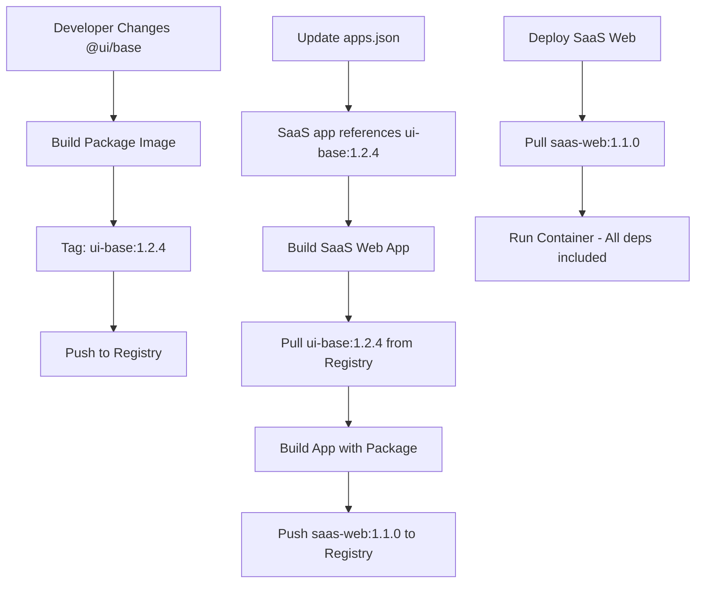
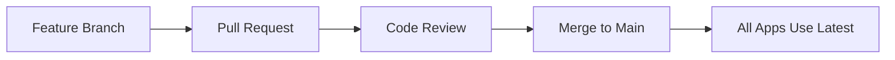
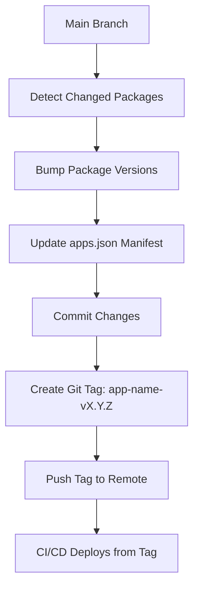
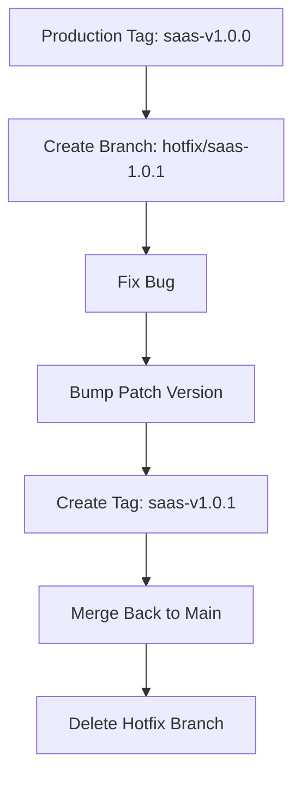

# Multi-Application Versioning Strategy

> **Purpose**: Guide for managing multiple independent applications within this monorepo using Docker Registry for package and app distribution, with independent versioning and dependency management.

## Table of Contents

1. [Problem Statement](#problem-statement)
2. [Core Concepts](#core-concepts)
3. [Recommended Strategy](#recommended-strategy)
4. [Docker Registry Architecture](#docker-registry-architecture)
5. [Implementation Guide](#implementation-guide)
6. [Git Workflows](#git-workflows)
7. [Package Publishing](#package-publishing)
8. [App Publishing](#app-publishing)
9. [Alternative Approaches](#alternative-approaches)
10. [Tooling & Automation](#tooling--automation)
11. [Best Practices](#best-practices)
12. [Migration Path](#migration-path)
13. [Real-World Examples](#real-world-examples)

---

## Problem Statement

### Current State

This monorepo currently has **one logical application**:
- `apps/api` - NestJS backend
- `apps/web` - Next.js frontend  
- `apps/doc` - Documentation site

These three components are **tightly coupled** and released together as a single "SaaS application".

### Future Scenario

A team wants to manage **multiple independent applications**:

**Application 1: SaaS Platform** (existing)
- `apps/api`
- `apps/web`
- `apps/doc`

**Application 2: Internal Dashboard**
- `apps/dashboard-api`
- `apps/dashboard-web`

**Application 3: Mobile Backend**
- `apps/mobile-api`

### The Challenge

All applications share packages:
- `@repo/ui/base` - UI components
- `@repo/types` - TypeScript types
- `@repo/contracts/api` - API contracts
- Config packages (eslint, typescript, etc.)

**Questions to solve:**
1. How can App 1 use `@ui/base@1.0.0` while App 2 uses `@ui/base@2.0.0`?
2. How do we version and release apps independently?
3. How do we prevent breaking changes in shared packages from affecting all apps?
4. How do we track which versions of shared packages each app uses?
5. How do we manage this with Git (branches, tags, commits)?

---

## Core Concepts

### 1. Logical Applications

A **logical application** is a group of components that:
- Are deployed together
- Share a common version/release cycle
- Have coordinated dependency requirements

```
Logical App = One or more workspace packages + specific versions of shared packages
```

**Example:**
```json
{
  "name": "SaaS Platform",
  "version": "1.0.0",
  "components": ["api", "web", "doc"],
  "sharedDependencies": {
    "@repo/ui/base": "1.2.3",
    "@repo/types": "2.0.1"
  }
}
```

### 2. Semantic Versioning for Shared Packages

All shared packages **MUST** follow semantic versioning:

- **Major (1.0.0 → 2.0.0)**: Breaking changes
- **Minor (1.0.0 → 1.1.0)**: New features, backward compatible
- **Patch (1.0.0 → 1.0.1)**: Bug fixes, backward compatible

This allows apps to declare version constraints:
- `^1.2.0` - "Any 1.x.x version >= 1.2.0"
- `~1.2.0` - "Any 1.2.x version"
- `1.2.0` - "Exactly this version"

### 3. Version Locking vs Version Ranges

**Development**: Use `workspace:*` for fast iteration
```json
{
  "dependencies": {
    "@repo/ui/base": "workspace:*"
  }
}
```

**Production**: Lock to specific versions
```json
{
  "dependencies": {
    "@repo/ui/base": "1.2.3"
  }
}
```

### 4. Application Manifest

A manifest tracks:
- Which packages belong to an application
- What version of shared dependencies the app uses
- Release metadata (version, date, changelog)

This is the **source of truth** for app deployments.

---

## Recommended Strategy

### Docker Registry-Based Package and App Distribution

**Core Idea**: All packages and apps are published as Docker images to a private registry. Dependencies are declared and resolved through Docker image tags, enabling true independent versioning.

#### Architecture

```
Docker Registry (your-registry.example.com)
├── packages/
│   ├── ui-base:1.0.0          ← Published package images
│   ├── ui-base:1.2.3
│   ├── ui-base:2.0.0
│   ├── types:1.0.0
│   ├── types:2.0.1
│   └── contracts-api:1.0.0
├── apps/
│   ├── saas-api:1.0.0         ← Published app images
│   ├── saas-web:1.0.0
│   ├── saas-doc:1.0.0
│   ├── dashboard-api:2.0.0
│   └── dashboard-web:2.0.0

Monorepo (Development)
├── apps/
│   ├── api/              (Build → your-registry.example.com/apps/saas-api:1.0.0)
│   ├── web/              (Build → your-registry.example.com/apps/saas-web:1.0.0)
│   ├── doc/              (Build → your-registry.example.com/apps/saas-doc:1.0.0)
│   ├── dashboard-api/    (Build → your-registry.example.com/apps/dashboard-api:2.0.0)
│   └── dashboard-web/    (Build → your-registry.example.com/apps/dashboard-web:2.0.0)
├── packages/
│   ├── ui/base/          (Build → your-registry.example.com/packages/ui-base:1.0.0)
│   ├── types/            (Build → your-registry.example.com/packages/types:2.0.1)
│   └── contracts/api/    (Build → your-registry.example.com/packages/contracts-api:1.0.0)
├── apps.json             ← Application manifest with Docker image references
└── package.json
```

#### Application Manifest (apps.json)

```json
{
  "$schema": "./apps.schema.json",
  "registry": {
    "url": "your-registry.example.com",
    "namespace": "myorg"
  },
  "applications": {
    "saas": {
      "name": "SaaS Platform",
      "version": "1.0.0",
      "description": "Main SaaS application",
      "components": {
        "api": {
          "path": "apps/api",
          "image": "your-registry.example.com/myorg/saas-api:1.0.0"
        },
        "web": {
          "path": "apps/web",
          "image": "your-registry.example.com/myorg/saas-web:1.0.0"
        },
        "doc": {
          "path": "apps/doc",
          "image": "your-registry.example.com/myorg/saas-doc:1.0.0"
        }
      },
      "packageDependencies": {
        "ui-base": {
          "version": "1.2.3",
          "image": "your-registry.example.com/myorg/packages/ui-base:1.2.3"
        },
        "types": {
          "version": "2.0.1",
          "image": "your-registry.example.com/myorg/packages/types:2.0.1"
        },
        "contracts-api": {
          "version": "1.0.0",
          "image": "your-registry.example.com/myorg/packages/contracts-api:1.0.0"
        }
      },
      "releases": [
        {
          "version": "1.0.0",
          "date": "2024-11-01",
          "tag": "saas-v1.0.0",
          "changelog": "Initial release"
        }
      ]
    },
    "dashboard": {
      "name": "Internal Dashboard",
      "version": "2.1.0",
      "description": "Admin dashboard",
      "components": {
        "api": {
          "path": "apps/dashboard-api",
          "image": "your-registry.example.com/myorg/dashboard-api:2.1.0"
        },
        "web": {
          "path": "apps/dashboard-web",
          "image": "your-registry.example.com/myorg/dashboard-web:2.1.0"
        }
      },
      "packageDependencies": {
        "ui-base": {
          "version": "2.0.0",
          "image": "your-registry.example.com/myorg/packages/ui-base:2.0.0"
        },
        "types": {
          "version": "2.0.1",
          "image": "your-registry.example.com/myorg/packages/types:2.0.1"
        },
        "contracts-api": {
          "version": "1.1.0",
          "image": "your-registry.example.com/myorg/packages/contracts-api:1.1.0"
        }
      },
      "releases": [
        {
          "version": "2.1.0",
          "date": "2024-11-02",
          "tag": "dashboard-v2.1.0",
          "changelog": "New analytics dashboard"
        }
      ]
    }
  }
}
```

#### How It Works

1. **Development**: All apps use `workspace:*` dependencies for local iteration
2. **Package Publishing**: 
   - Build package as Docker image with bundled code
   - Tag with semantic version
   - Push to private Docker registry
3. **App Building**: 
   - App Dockerfile pulls required package images
   - Copies package code from package images
   - Builds app with specific package versions
4. **App Publishing**:
   - Push built app image to registry
   - Tag with app version
5. **Deployment**: 
   - Pull app image from registry
   - All dependencies already bundled
   - Run container

---

## Docker Registry Architecture

### Package as Docker Image

Each shared package is built into a Docker image:

```dockerfile
# packages/ui/base/Dockerfile
FROM node:20-alpine AS builder
WORKDIR /package

# Copy package files
COPY package.json tsconfig.json ./
COPY src/ ./src/

# Install dependencies and build
RUN npm install
RUN npm run build

# Create distribution image
FROM scratch
COPY --from=builder /package/dist /dist
COPY --from=builder /package/package.json /package.json
```

**Published as:**
```
your-registry.example.com/myorg/packages/ui-base:1.2.3
```

**Contains:**
- `/dist/` - Compiled JavaScript/TypeScript
- `/package.json` - Package metadata

### App Using Package Images

Apps pull package images during build:

```dockerfile
# apps/web/Dockerfile
FROM node:20-alpine AS packages

# Pull package images from registry
COPY --from=your-registry.example.com/myorg/packages/ui-base:1.2.3 / /packages/ui-base
COPY --from=your-registry.example.com/myorg/packages/types:2.0.1 / /packages/types
COPY --from=your-registry.example.com/myorg/packages/contracts-api:1.0.0 / /packages/contracts

FROM node:20-alpine AS builder
WORKDIR /app

# Copy packages from previous stage
COPY --from=packages /packages /packages

# Copy app source
COPY apps/web/ ./

# Install app dependencies (not package dependencies)
RUN npm install

# Build with packages available
RUN npm run build

# Production image
FROM node:20-alpine
WORKDIR /app
COPY --from=builder /app/.next ./.next
COPY --from=builder /app/package.json ./
CMD ["npm", "start"]
```

**Published as:**
```
your-registry.example.com/myorg/saas-web:1.0.0
```

### Dependency Resolution Flow



### Multi-Version Coexistence

**Scenario:** SaaS uses ui-base:1.2.3, Dashboard uses ui-base:2.0.0

```
Registry:
├── packages/ui-base:1.2.3  ← SaaS depends on this
├── packages/ui-base:2.0.0  ← Dashboard depends on this

Apps (built images):
├── saas-web:1.0.0          ← Contains ui-base:1.2.3 code
└── dashboard-web:2.0.0     ← Contains ui-base:2.0.0 code

Deployment:
├── saas-web:1.0.0 (running with ui-base 1.2.3)
└── dashboard-web:2.0.0 (running with ui-base 2.0.0)
```

Both apps run simultaneously with different package versions!

---

## Implementation Guide

### Step 1: Setup Private Docker Registry

**Option A: Self-hosted Registry**

```bash
# Run Docker registry on your server
docker run -d \
  -p 5000:5000 \
  --restart=always \
  --name registry \
  -v /mnt/registry:/var/lib/registry \
  registry:2

# With authentication
docker run -d \
  -p 5000:5000 \
  --restart=always \
  --name registry \
  -v /mnt/registry:/var/lib/registry \
  -v /mnt/auth:/auth \
  -e "REGISTRY_AUTH=htpasswd" \
  -e "REGISTRY_AUTH_HTPASSWD_REALM=Registry Realm" \
  -e "REGISTRY_AUTH_HTPASSWD_PATH=/auth/htpasswd" \
  registry:2
```

**Option B: Cloud Registry**
- Harbor (self-hosted)
- Azure Container Registry
- AWS ECR  
- Google Container Registry
- GitLab Container Registry

### Step 2: Configure Registry in Repository

Create `.env`:

```bash
# Docker Registry Configuration
DOCKER_REGISTRY=your-registry.example.com
DOCKER_NAMESPACE=myorg
DOCKER_USERNAME=your-username
DOCKER_PASSWORD=your-password
```

Add to `.gitignore`:
```
.env
.env.local
```

### Step 3: Add Dockerfiles to Packages

Each package needs a `Dockerfile`:

```dockerfile
# packages/ui/base/Dockerfile
FROM oven/bun:1.2.14-alpine AS builder
WORKDIR /package

# Copy package source
COPY package.json bun.lockb tsconfig.json ./
COPY src/ ./src/

# Install and build
RUN bun install --frozen-lockfile
RUN bun run build

# Create distribution image (FROM scratch for minimal size)
FROM scratch AS release
COPY --from=builder /package/dist /dist
COPY --from=builder /package/package.json /package.json

LABEL org.opencontainers.image.title="@repo/ui/base"
LABEL org.opencontainers.image.source="https://github.com/yourorg/yourrepo"
```

### Step 4: Create Package Publishing Script

Create `scripts/publish-package.ts`:

```typescript
#!/usr/bin/env bun
import { execSync } from 'child_process'
import fs from 'fs/promises'
import path from 'path'

interface PublishOptions {
  packagePath: string
  registry: string
  namespace: string
  dryRun?: boolean
}

async function publishPackage(options: PublishOptions) {
  const { packagePath, registry, namespace, dryRun = false } = options

  // Read package.json
  const packageJsonPath = path.join(packagePath, 'package.json')
  const packageJson = JSON.parse(
    await fs.readFile(packageJsonPath, 'utf-8')
  )

  // Extract package name (remove @repo/ prefix)
  const fullName = packageJson.name // e.g., "@repo/ui/base"
  const packageName = fullName.replace('@repo/', '').replace(/\//g, '-') // "ui-base"
  const version = packageJson.version

  if (!version) {
    throw new Error(`Package ${fullName} missing version in package.json`)
  }

  console.log(`📦 Publishing ${fullName}@${version}`)

  // Check for Dockerfile
  const dockerfilePath = path.join(packagePath, 'Dockerfile')
  try {
    await fs.access(dockerfilePath)
  } catch {
    throw new Error(`No Dockerfile found at ${dockerfilePath}`)
  }

  // Build image
  const imageName = `${registry}/${namespace}/packages/${packageName}`
  const tags = [
    `${imageName}:${version}`,
    `${imageName}:latest`
  ]

  const buildCommand = [
    'docker build',
    `--build-arg VERSION=${version}`,
    ...tags.map(tag => `-t ${tag}`),
    `-f ${dockerfilePath}`,
    packagePath
  ].join(' ')

  console.log(`🔨 Building: ${imageName}:${version}`)
  
  if (!dryRun) {
    execSync(buildCommand, { stdio: 'inherit' })
  } else {
    console.log(`[DRY RUN] ${buildCommand}`)
  }

  // Push images
  for (const tag of tags) {
    console.log(`📤 Pushing: ${tag}`)
    if (!dryRun) {
      execSync(`docker push ${tag}`, { stdio: 'inherit' })
    } else {
      console.log(`[DRY RUN] docker push ${tag}`)
    }
  }

  console.log(`✅ Published ${fullName}@${version}`)
  
  return {
    name: packageName,
    fullName,
    version,
    image: `${imageName}:${version}`,
    latestImage: `${imageName}:latest`
  }
}

// CLI execution
if (import.meta.main) {
  const packagePath = process.argv[2]
  const registry = process.env.DOCKER_REGISTRY || 'localhost:5000'
  const namespace = process.env.DOCKER_NAMESPACE || 'myorg'
  const dryRun = process.argv.includes('--dry-run')

  if (!packagePath) {
    console.error('Usage: bun run publish-package.ts <package-path> [--dry-run]')
    process.exit(1)
  }

  publishPackage({ packagePath, registry, namespace, dryRun })
    .catch(error => {
      console.error('❌ Failed to publish package:', error.message)
      process.exit(1)
    })
}

export { publishPackage }
```

### Step 5: Add Dockerfiles to Apps

Apps pull package images during build:

```dockerfile
# apps/web/Dockerfile
ARG REGISTRY
ARG NAMESPACE

# Import package images (these will be pulled from registry)
FROM ${REGISTRY}/${NAMESPACE}/packages/ui-base:1.2.3 AS pkg-ui-base
FROM ${REGISTRY}/${NAMESPACE}/packages/types:2.0.1 AS pkg-types
FROM ${REGISTRY}/${NAMESPACE}/packages/contracts-api:1.0.0 AS pkg-contracts

# Setup workspace with packages
FROM node:20-alpine AS packages-setup
WORKDIR /workspace

# Recreate monorepo structure
RUN mkdir -p packages/ui/base packages/types packages/contracts/api

# Copy packages from imported images
COPY --from=pkg-ui-base /dist /workspace/packages/ui/base/dist
COPY --from=pkg-ui-base /package.json /workspace/packages/ui/base/package.json

COPY --from=pkg-types /dist /workspace/packages/types/dist
COPY --from=pkg-types /package.json /workspace/packages/types/package.json

COPY --from=pkg-contracts /dist /workspace/packages/contracts/api/dist
COPY --from=pkg-contracts /package.json /workspace/packages/contracts/api/package.json

# Build stage
FROM oven/bun:1.2.14-alpine AS builder
WORKDIR /app

# Copy packages
COPY --from=packages-setup /workspace/packages ./packages

# Copy app source
COPY apps/web/package.json apps/web/bun.lockb* ./
COPY apps/web ./

# Install app dependencies
RUN bun install --frozen-lockfile

# Build
RUN bun run build

# Production stage
FROM oven/bun:1.2.14-alpine AS runner
WORKDIR /app

ENV NODE_ENV=production

COPY --from=builder /app/.next/standalone ./
COPY --from=builder /app/.next/static ./.next/static
COPY --from=builder /app/public ./public

EXPOSE 3000
CMD ["bun", "server.js"]
```

### Step 6: Create App Publishing Script

Create `scripts/publish-app.ts`:

```typescript
#!/usr/bin/env bun
import { execSync } from 'child_process'
import fs from 'fs/promises'

interface AppPublishOptions {
  appName: string
  componentName: string
  registry: string
  namespace: string
  dryRun?: boolean
}

async function publishApp(options: AppPublishOptions) {
  const { appName, componentName, registry, namespace, dryRun = false } = options

  // Load apps.json
  const appsConfig = JSON.parse(
    await fs.readFile('apps.json', 'utf-8')
  )

  const app = appsConfig.applications[appName]
  if (!app) {
    throw new Error(`App ${appName} not found in apps.json`)
  }

  const component = app.components[componentName]
  if (!component) {
    throw new Error(`Component ${componentName} not found in app ${appName}`)
  }

  // Get package dependencies
  const packages = app.packageDependencies || {}
  
  console.log(`📦 Publishing ${appName}-${componentName}:${app.version}`)
  console.log(`   Package dependencies:`)
  Object.entries(packages).forEach(([name, dep]: [string, any]) => {
    console.log(`     - ${name}@${dep.version}`)
  })

  // Build image with package version arguments
  const imageName = `${registry}/${namespace}/${appName}-${componentName}`
  const tags = [
    `${imageName}:${app.version}`,
    `${imageName}:latest`
  ]

  const buildArgs = [
    `--build-arg REGISTRY=${registry}`,
    `--build-arg NAMESPACE=${namespace}`,
    ...Object.entries(packages).map(([name, dep]: [string, any]) => {
      const argName = `PKG_${name.toUpperCase().replace(/-/g, '_')}_VERSION`
      return `--build-arg ${argName}=${dep.version}`
    })
  ]

  const buildCommand = [
    'docker build',
    ...buildArgs,
    ...tags.map(tag => `-t ${tag}`),
    `-f ${component.path}/Dockerfile`,
    '.' // Build from repo root
  ].join(' ')

  console.log(`🔨 Building: ${imageName}:${app.version}`)
  
  if (!dryRun) {
    execSync(buildCommand, { stdio: 'inherit' })
  } else {
    console.log(`[DRY RUN] ${buildCommand}`)
  }

  // Push images
  for (const tag of tags) {
    console.log(`📤 Pushing: ${tag}`)
    if (!dryRun) {
      execSync(`docker push ${tag}`, { stdio: 'inherit' })
    } else {
      console.log(`[DRY RUN] docker push ${tag}`)
    }
  }

  console.log(`✅ Published ${appName}-${componentName}:${app.version}`)

  // Update apps.json with published image
  component.image = `${imageName}:${app.version}`
  await fs.writeFile('apps.json', JSON.stringify(appsConfig, null, 2))

  return {
    appName,
    componentName,
    version: app.version,
    image: `${imageName}:${app.version}`
  }
}

// CLI execution
if (import.meta.main) {
  const appName = process.argv[2]
  const componentName = process.argv[3]
  const registry = process.env.DOCKER_REGISTRY || 'localhost:5000'
  const namespace = process.env.DOCKER_NAMESPACE || 'myorg'
  const dryRun = process.argv.includes('--dry-run')

  if (!appName || !componentName) {
    console.error('Usage: bun run publish-app.ts <app-name> <component-name> [--dry-run]')
    console.error('Example: bun run publish-app.ts saas web')
    process.exit(1)
  }

  publishApp({ appName, componentName, registry, namespace, dryRun })
    .catch(error => {
      console.error('❌ Failed to publish app:', error.message)
      process.exit(1)
    })
}

export { publishApp }
```

### Step 7: Update apps.json

Create comprehensive manifest with Docker images:

```json
{
  "$schema": "./apps.schema.json",
  "registry": {
    "url": "your-registry.example.com",
    "namespace": "myorg"
  },
  "applications": {
    "saas": {
      "name": "SaaS Platform",
      "version": "1.0.0",
      "components": {
        "api": {
          "path": "apps/api",
          "image": null
        },
        "web": {
          "path": "apps/web",
          "image": null
        },
        "doc": {
          "path": "apps/doc",
          "image": null
        }
      },
      "packageDependencies": {
        "ui-base": {
          "version": "1.0.0",
          "image": null
        },
        "types": {
          "version": "1.0.0",
          "image": null
        },
        "contracts-api": {
          "version": "1.0.0",
          "image": null
        }
      }
    }
  }
}
```

### Step 8: Add Scripts to package.json

```json
{
  "scripts": {
    "docker:login": "docker login $DOCKER_REGISTRY -u $DOCKER_USERNAME -p $DOCKER_PASSWORD",
    "publish:package": "bun run scripts/publish-package.ts",
    "publish:app": "bun run scripts/publish-app.ts",
    "publish:all-packages": "for pkg in packages/*/; do bun run publish:package \"$pkg\"; done",
    "publish:saas": "bun run scripts/publish-app.ts saas web && bun run scripts/publish-app.ts saas api && bun run scripts/publish-app.ts saas doc"
  }
}
```

---

## Git Workflows

### Development Workflow (Trunk-Based)



**Process:**
1. Create feature branch from `main`
2. Make changes to apps or shared packages
3. Open pull request
4. Review and merge to `main`
5. All apps automatically use latest `workspace:*` versions

**Key Points:**
- Single `main` branch for all development
- All apps share the same codebase state
- Fast iteration, no version conflicts during development

### Release Workflow (Per Application)



**Example: Releasing SaaS App v1.1.0**

```bash
# 1. Ensure main is up to date
git checkout main
git pull origin main

# 2. Run release script (interactive)
bun run release:saas

# The script will:
# - Detect changed packages since last release
# - Prompt for version bumps (major/minor/patch)
# - Update package.json files
# - Update apps.json with new dependency versions
# - Bump app version
# - Create git commit
# - Create git tag: saas-v1.1.0

# 3. Push to remote
git push origin main --tags

# 4. CI/CD automatically deploys from tag saas-v1.1.0
```

**Result:**
- Main branch updated with new versions
- Git tag `saas-v1.1.0` points to this release
- Other apps (dashboard, mobile) are unaffected
- They can continue using older versions of shared packages

### Hotfix Workflow



**Example: Hotfix for SaaS v1.0.0**

```bash
# 1. Create hotfix branch from production tag
git checkout -b hotfix/saas-1.0.1 saas-v1.0.0

# 2. Fix the bug
# Edit files in apps/api, apps/web, or packages/

# 3. Bump patch versions
bun run version:package @repo/ui/base patch
# Update apps.json manually with new version

# 4. Commit and tag
git add .
git commit -m "fix(saas): critical security fix"
git tag -a saas-v1.0.1 -m "Hotfix v1.0.1"

# 5. Push hotfix
git push origin saas-v1.0.1

# 6. Merge back to main (to include fix in future releases)
git checkout main
git merge hotfix/saas-1.0.1
git push origin main

# 7. Clean up
git branch -d hotfix/saas-1.0.1
```

### Multi-App Release (Same Day)

When releasing multiple apps on the same day:

```bash
# Release saas app
bun run release:saas
# Creates: saas-v1.1.0

# Release dashboard app  
bun run release:dashboard
# Creates: dashboard-v2.0.0

# Both tags point to same commit (or nearby commits)
# But each app has different dependency versions in apps.json

git push origin main --tags
```

---

## Deployment Strategies

### Strategy 1: Docker with Build-Time Resolution (Recommended)

Each app builds into a Docker image that bundles its dependencies.

**apps/web/Dockerfile:**
```dockerfile
FROM oven/bun:1.2.14 AS base

# Build stage
FROM base AS builder
WORKDIR /app

# Copy monorepo
COPY . .

# Install dependencies (uses workspace:*)
RUN bun install --frozen-lockfile

# Build the web app (bundles @repo/ui/base, etc.)
RUN bun run build --filter=web

# Production stage
FROM base AS runner
WORKDIR /app

# Copy built app (includes bundled dependencies)
COPY --from=builder /app/apps/web/.next ./.next
COPY --from=builder /app/apps/web/package.json ./package.json

# Run
CMD ["bun", "start"]
```

**Key Points:**
- Each app builds from the same commit (git tag)
- During build, `workspace:*` resolves to current local versions
- Different apps can build from different tags → different dependency versions
- Deployed images are completely independent

**Example:**
```bash
# Build SaaS app from tag saas-v1.0.0 (uses @ui/base@1.2.3)
docker build -f apps/web/Dockerfile --tag saas-web:1.0.0 .

# Build Dashboard app from tag dashboard-v2.0.0 (uses @ui/base@2.0.0)
docker build -f apps/dashboard-web/Dockerfile --tag dashboard-web:2.0.0 .

# Both images run simultaneously with different @ui/base versions!
```

### Strategy 2: Monolithic Deployment (Shared Runtime)

All apps deployed together, sharing `node_modules`.

**Constraints:**
- All apps MUST use the same version of shared packages
- No version divergence possible
- Simpler deployment, but less flexibility

**When to use:**
- Small team with tightly coupled apps
- All apps release together
- Don't need independent versioning

**Implementation:**
```bash
# Deploy everything together
bun install
bun run build
bun run start:all
```

### Strategy 3: Hybrid (Microservices + Shared Frontend)

API services deployed independently (Docker), frontends share runtime.

**Example:**
- `api`, `dashboard-api`, `mobile-api` → Separate Docker containers
- `web`, `dashboard-web` → Deployed together on same server

**When to use:**
- APIs have different scaling needs
- Frontends can share versions
- Balance between independence and simplicity

---

## Alternative Approaches

### Approach 1: Independent Package Repositories

**Architecture:**
```
Monorepo A (Main)
├── apps/api
├── apps/web
└── apps/doc

Monorepo B (Shared Packages)
├── packages/ui/base
├── packages/types
└── packages/contracts
```

**How it works:**
- Shared packages live in separate repository
- Published to npm (private registry)
- Apps install from registry with version constraints

**Pros:**
- True independent versioning
- Clear package boundaries
- Standard npm workflow

**Cons:**
- Slower development (publish required)
- Separate repositories to manage
- Versioning overhead

**When to use:**
- Multiple teams working independently
- Packages used by external projects
- Strict versioning requirements

### Approach 2: Git Submodules

**Architecture:**
```
monorepo/
├── apps/
│   ├── api/
│   ├── web/
│   └── doc/
└── packages/          ← Git submodule
    ├── ui/            ← Points to specific commit
    ├── types/         ← Points to specific commit
    └── contracts/     ← Points to specific commit
```

**How it works:**
- Each shared package is a separate git repository
- Main repo includes them as submodules
- Each submodule pointer is a specific commit

**Pros:**
- Per-package version control
- Clear dependency commits
- Standard git tooling

**Cons:**
- Submodule management complexity
- Slower development (update submodules)
- Easy to get out of sync

**When to use:**
- Large organization with separate teams per package
- Need strict version control
- Packages evolve independently

### Approach 3: Changesets-Based Versioning

**Architecture:**
Same monorepo structure, but use [Changesets](https://github.com/changesets/changesets) for versioning.

**How it works:**
- Developers add `.changeset` files describing changes
- Changesets CLI bumps versions automatically
- Generates changelogs
- Coordinates package releases

**Pros:**
- Automated versioning
- Great changelog generation
- Handles dependencies well

**Cons:**
- Assumes npm publishing workflow
- All packages versioned together (by default)
- Learning curve for changeset format

**When to use:**
- Publishing packages to npm
- Want automated changelog generation
- Need coordinated version bumps

**Adaptation for multi-app:**
```bash
# Add changeset for a change
npx changeset add

# Release saas app
npx changeset version --filter saas
git tag saas-v1.1.0

# Release dashboard app separately
npx changeset version --filter dashboard
git tag dashboard-v2.0.0
```

---

## Tooling & Automation

### Essential Scripts

Add to root `package.json`:

```json
{
  "scripts": {
    "apps:list": "bun run scripts/list-apps.ts",
    "apps:status": "bun run scripts/apps-status.ts",
    "release:app": "bun run scripts/release-app.ts",
    "version:bump": "bun run scripts/version-bump.ts",
    "deps:check": "bun run scripts/check-dependencies.ts",
    "deps:sync": "bun run scripts/sync-dependencies.ts"
  }
}
```

### Recommended Tools

#### 1. **Turborepo** (Already Included)
- Caching for builds and tests
- Task orchestration
- Already configured in this repo

#### 2. **Changesets** (Optional)
```bash
bun add -D @changesets/cli
npx changeset init
```

Configure for app-specific versioning:
```json
// .changeset/config.json
{
  "changelog": "@changesets/cli/changelog",
  "commit": false,
  "fixed": [],
  "linked": [
    ["apps/api", "apps/web", "apps/doc"]  // SaaS app components
  ],
  "access": "restricted",
  "baseBranch": "main"
}
```

#### 3. **Conventional Commits** (Recommended)
Enforce commit message format:
```bash
bun add -D @commitlint/cli @commitlint/config-conventional
```

Configure `.commitlintrc.json`:
```json
{
  "extends": ["@commitlint/config-conventional"],
  "rules": {
    "scope-enum": [2, "always", [
      "saas", "dashboard", "mobile",
      "ui", "types", "contracts"
    ]]
  }
}
```

#### 4. **Release Automation**
Use GitHub Actions or similar:

```yaml
# .github/workflows/release.yml
name: Release Application

on:
  push:
    tags:
      - 'saas-v*'
      - 'dashboard-v*'
      - 'mobile-v*'

jobs:
  deploy:
    runs-on: ubuntu-latest
    steps:
      - uses: actions/checkout@v3
      
      - name: Extract app name and version
        id: tag
        run: |
          TAG=${GITHUB_REF#refs/tags/}
          APP=$(echo $TAG | cut -d'-' -f1)
          VERSION=$(echo $TAG | cut -d'-' -f2)
          echo "app=$APP" >> $GITHUB_OUTPUT
          echo "version=$VERSION" >> $GITHUB_OUTPUT
      
      - name: Build and deploy
        run: |
          # Load apps.json to get deployment config
          # Build Docker images
          # Deploy to infrastructure
```

---

## Best Practices

### 1. Clear Application Boundaries

Define logical applications clearly:
```json
// ✅ GOOD: Clear application grouping
{
  "applications": {
    "saas": {
      "components": ["apps/api", "apps/web", "apps/doc"]
    },
    "dashboard": {
      "components": ["apps/dashboard-api", "apps/dashboard-web"]
    }
  }
}

// ❌ BAD: Unclear grouping
{
  "applications": {
    "backend": {
      "components": ["apps/api", "apps/dashboard-api"]
    }
  }
}
```

### 2. Semantic Versioning Discipline

Follow semver strictly:
```
Breaking change to @ui/base?     → Major bump (1.0.0 → 2.0.0)
New component in @ui/base?       → Minor bump (1.0.0 → 1.1.0)
Bug fix in @ui/base?             → Patch bump (1.0.0 → 1.0.1)
```

### 3. Document Breaking Changes

When making breaking changes to shared packages:

```typescript
// @ui/base v2.0.0 BREAKING CHANGE

// BEFORE (v1.x.x)
<Button variant="primary">Click</Button>

// AFTER (v2.0.0)
<Button color="primary">Click</Button>  // "variant" renamed to "color"
```

Add to CHANGELOG.md:
```markdown
## [2.0.0] - 2024-11-03

### BREAKING CHANGES
- Renamed Button `variant` prop to `color` for consistency
- Apps using v1.x.x must update Button usages before upgrading
```

### 4. Test Before Releasing

Before tagging a release:
```bash
# Type check all affected apps
bun run type-check --filter=saas

# Run tests
bun run test --filter=saas

# Build to verify no errors
bun run build --filter=saas
```

### 5. Keep Main Stable

Main branch should always be deployable:
- Use feature branches for experimental work
- Require passing CI before merging
- Tag releases only from main

### 6. Communicate Releases

When releasing, notify the team:
```
🚀 Released saas v1.1.0

Changes:
- New dashboard analytics
- Performance improvements in API
- Updated @ui/base to v1.5.0

Tag: saas-v1.1.0
Deployed to: production
```

### 7. Maintain Changelogs

Each app should have a CHANGELOG.md:
```markdown
# SaaS Application Changelog

## [1.1.0] - 2024-11-03
### Added
- New analytics dashboard
- User preferences page

### Changed
- Updated @ui/base to v1.5.0 (new Button variants)

### Fixed
- Fixed login redirect issue

## [1.0.0] - 2024-11-01
### Added
- Initial release
```

---

## Migration Path

### Phase 1: Add Versioning to Shared Packages

**Week 1:**
1. Add versions to all `packages/*/package.json` files
2. Start at `1.0.0` for all packages
3. Document current API as the baseline

**No code changes required**, just metadata.

### Phase 2: Create Application Manifest

**Week 2:**
1. Create `apps.json` with current app structure
2. Document existing "saas" application
3. Lock current dependency versions

**Example:**
```json
{
  "applications": {
    "saas": {
      "name": "SaaS Platform",
      "version": "1.0.0",
      "components": ["apps/api", "apps/web", "apps/doc"],
      "dependencies": {
        "@repo/ui/base": "1.0.0",
        "@repo/types": "1.0.0",
        "@repo/contracts/api": "1.0.0"
      }
    }
  }
}
```

### Phase 3: Implement Release Scripts

**Week 3:**
1. Create `scripts/release-app.ts`
2. Add release commands to `package.json`
3. Test releasing the existing "saas" app

**Validation:**
```bash
# Dry run
bun run release:saas --dry-run

# Verify it creates correct tags and updates apps.json
```

### Phase 4: Add Second Application

**Week 4+:**
1. Create new application components (e.g., dashboard)
2. Add to `apps.json`
3. Test independent releases

**Example:**
```bash
# Release saas v1.1.0
bun run release:saas

# Release dashboard v1.0.0 (first release)
bun run release:dashboard

# Both apps now have independent versions
```

### Phase 5: Refine Workflows

**Ongoing:**
1. Add CI/CD automation for releases
2. Implement automated testing per app
3. Create deployment pipelines per app
4. Train team on workflows

---

## Real-World Examples

### Example 1: Adding a Feature to SaaS App

**Scenario:** Add new user profile page to SaaS app.

**Steps:**
1. Create feature branch
```bash
git checkout -b feature/user-profile
```

2. Make changes
```bash
# Edit apps/web/src/app/profile/page.tsx
# Add new components to @repo/ui/base
```

3. Test locally (uses workspace:*)
```bash
bun run dev
```

4. Merge to main
```bash
git checkout main
git merge feature/user-profile
git push origin main
```

5. Release when ready
```bash
bun run release:saas
# Prompts for version: 1.1.0 (minor bump - new feature)
# Updates @repo/ui/base: 1.0.0 → 1.1.0
# Creates tag: saas-v1.1.0
```

**Result:** SaaS app v1.1.0 released with new feature.

### Example 2: Breaking Change in Shared Package

**Scenario:** Refactor @ui/base Button component (breaking change).

**Steps:**
1. Update Button component
```typescript
// Before
<Button variant="primary">

// After  
<Button color="primary">
```

2. Bump @ui/base version to 2.0.0
```bash
bun run version:bump @repo/ui/base major
# 1.5.0 → 2.0.0
```

3. Update CHANGELOG.md in @repo/ui/base
```markdown
## [2.0.0] - 2024-11-03
### BREAKING CHANGES
- Renamed Button `variant` prop to `color`
```

4. Update SaaS app to use new API
```bash
# Find and replace in apps/web
variant="primary" → color="primary"
```

5. Release SaaS with updated dependency
```bash
bun run release:saas
# Updates apps.json: "@repo/ui/base": "2.0.0"
# Bumps to saas-v2.0.0 (major - breaking change propagated)
```

6. Dashboard app remains on old version
```json
// Dashboard still uses:
"@repo/ui/base": "1.5.0"

// Will upgrade when ready (independent schedule)
```

### Example 3: Hotfix for Production

**Scenario:** Critical security bug in SaaS v1.0.0 (already deployed).

**Steps:**
1. Create hotfix branch from production tag
```bash
git checkout -b hotfix/saas-1.0.1 saas-v1.0.0
```

2. Fix the bug
```bash
# Edit apps/api/src/security-fix.ts
```

3. Update version and tag
```bash
# Update apps.json manually
# "version": "1.0.1"

git add apps.json apps/api/src/security-fix.ts
git commit -m "fix(saas): security vulnerability CVE-2024-1234"
git tag -a saas-v1.0.1 -m "Security hotfix"
```

4. Deploy hotfix
```bash
git push origin saas-v1.0.1
# CI/CD deploys from tag
```

5. Merge back to main
```bash
git checkout main
git merge hotfix/saas-1.0.1
git push origin main
```

**Result:** Production fixed without affecting main development.

### Example 4: Multiple Apps Using Different Versions

**Scenario:** SaaS and Dashboard apps need different @ui/base versions.

**Current State:**
```json
// apps.json
{
  "applications": {
    "saas": {
      "version": "1.0.0",
      "dependencies": {
        "@repo/ui/base": "1.5.0"
      }
    },
    "dashboard": {
      "version": "1.0.0",
      "dependencies": {
        "@repo/ui/base": "1.5.0"
      }
    }
  }
}
```

**Update Scenario:**
1. SaaS upgrades to @ui/base@2.0.0
```bash
bun run release:saas
# Select @repo/ui/base: 2.0.0
# SaaS v2.0.0 released
```

2. Dashboard stays on @ui/base@1.5.0
```bash
# No changes to dashboard
# dashboard v1.0.0 still uses @ui/base@1.5.0
```

**Deployment:**
```bash
# Build SaaS (uses @ui/base@2.0.0)
docker build -f apps/web/Dockerfile --tag saas:2.0.0 .

# Build Dashboard (uses @ui/base@1.5.0)
docker build -f apps/dashboard/Dockerfile --tag dashboard:1.0.0 .

# Both run simultaneously with different versions!
```

**When Dashboard is ready to upgrade:**
```bash
# Update Dashboard code for @ui/base@2.0.0 API
bun run release:dashboard
# Select @repo/ui/base: 2.0.0
# Dashboard v2.0.0 released
```

---

## Conclusion

This strategy provides:

✅ **Independent App Versioning** - Each app has its own version and release cycle  
✅ **Flexible Dependency Management** - Apps can use different versions of shared packages  
✅ **Simple Development** - Use workspace:* for fast iteration  
✅ **Reproducible Deployments** - Git tags + manifests ensure consistency  
✅ **Team Collaboration** - Clear workflows for releases and hotfixes  
✅ **Gradual Adoption** - Can migrate incrementally without disrupting current work

### Quick Decision Matrix

| Scenario | Recommended Approach |
|----------|---------------------|
| Small team, tightly coupled apps | Monolithic deployment (shared versions) |
| Multiple teams, independent apps | Application-centric versioning (this doc) |
| Publishing packages externally | Independent package repos + npm registry |
| Need strict audit trail | Git submodules |
| Want automation | Changesets + CI/CD |

### Next Steps

1. Review this strategy with your team
2. Start with Phase 1 (add versioning to packages)
3. Implement apps.json manifest
4. Create release scripts
5. Test with a second application
6. Iterate and refine

---

## Additional Resources

- [Semantic Versioning](https://semver.org/)
- [Turborepo Documentation](https://turbo.build/repo/docs)
- [Changesets Documentation](https://github.com/changesets/changesets)
- [Conventional Commits](https://www.conventionalcommits.org/)
- [Trunk-Based Development](https://trunkbaseddevelopment.com/)
- [Monorepo Tools Comparison](https://monorepo.tools/)

---

**Questions or Issues?**  
Open an issue in the repository or discuss with the team during sprint planning.
