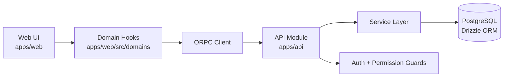

<DocMeta source=".docs/reference/ARCHITECTURE.md" scope="canonical" />

## Monorepo topology

- `apps/api`: NestJS runtime (ORPC implementation + auth + DB access)
- `apps/web`: Next.js App Router frontend
- `apps/doc`: Fumadocs-powered documentation app
- `packages/contracts/api`: shared ORPC contracts
- `packages/utils/*`: shared runtime/tooling utilities
- `packages/ui/base`: shared UI components
- `packages/configs/*`: linting/build/test configuration packages

## Data Flow

1. Client UI invokes typed ORPC query/mutation hooks.
2. ORPC client routes requests to API endpoints.
3. API controllers implement shared contracts using NestJS + ORPC.
4. Service layer coordinates authorization, business logic, and persistence.
5. Drizzle handles PostgreSQL query/mutation execution.

## Request path diagram

## Authentication flow

- Better Auth handles identity/session primitives.
- API applies auth-aware guards and permission checks.
- Web reads session state via auth client and domain hooks.
- Role/permission conditions gate route and UI access.

<DocCallout title="Boundary rule" tone="warning">
Keep contract definitions in shared packages, implementations in API, and UI data orchestration in web domain hooks.
</DocCallout>

## Docker Topology

- `web` container: Next.js frontend
- `api` container: NestJS backend
- `postgres` container: primary relational storage
- `redis` container: cache/session support

## Implementation order (for architecture-impacting changes)

<DocStepFlow
	steps={[
		{
			title: 'Update contracts first',
			description: 'Keep shared API contracts as the source of type truth before implementation.',
		},
		{
			title: 'Implement API behavior',
			description: 'Apply business logic and authorization in API modules/services.',
		},
		{
			title: 'Regenerate and connect web hooks',
			description: 'Refresh generated artifacts, then wire usage through web domain hooks.',
		},
		{
			title: 'Validate system-wide',
			description: 'Run check scripts to ensure architecture contracts stay coherent end-to-end.',
		},
	]}
/>

## Related docs

- [Tech Stack](/docs/architecture/tech-stack)
- [Development Workflow](/docs/dev/development-workflow)
- [ORPC Type-Safe API Workflow](/docs/dev/orpc)
