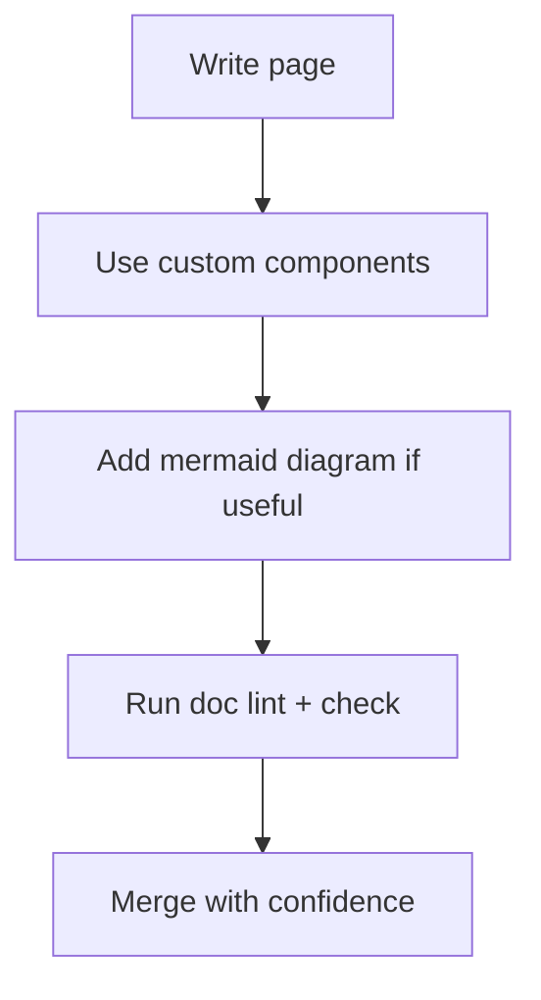

<DocMeta source="apps/doc/src/components/docs/*" scope="canonical" rewritten={false} />

## Why this exists

This page documents how the docs app is authored so contributors can produce **relevant**, **structured**, and **visual** documentation consistently.

<DocCallout title="Authoring rule" tone="info">
Prefer task-focused pages with real commands, clear boundaries, and diagrams only when they improve understanding.
</DocCallout>

## Available custom components

<DocCardGrid>
  <DocCard
    title="DocCallout"
    href="#doccallout"
    description="Highlight important constraints, caveats, or migration notes."
    badge="Context"
  />
  <DocCard
    title="DocChecklist"
    href="#docchecklist"
    description="Track readiness criteria and rollout checks."
    badge="Validation"
  />
  <DocCard
    title="DocStepFlow"
    href="#docstepflow"
    description="Show sequence-oriented workflows in a scannable format."
    badge="Process"
  />
  <DocCard
    title="Mermaid"
    href="#mermaid-diagrams"
    description="Render architecture/flow diagrams directly from Mermaid syntax."
    badge="Visual"
  />
</DocCardGrid>

### DocCallout

```mdx
<DocCallout title="Boundary rule" tone="warning">
  Keep contracts in shared packages and implementation in the API app.
</DocCallout>
```

### DocChecklist

```mdx
<DocChecklist
  items={[
    { label: 'Contracts updated', done: true },
    { label: 'Tests pass', done: false },
  ]}
/>
```

### DocStepFlow

```mdx
<DocStepFlow
  steps={[
    { title: 'Define contract', description: 'Create/update shared ORPC contract.' },
    { title: 'Implement endpoint', description: 'Apply business logic in API.' },
  ]}
/>
```

## Mermaid diagrams

You have two ways to render Mermaid:

1. Explicit component: `<Mermaid chart="..." />`
2. Standard fenced block with language `mermaid` (recommended)

The docs app automatically detects `mermaid` fenced blocks and renders them as diagrams.



## Relevance checklist

<DocChecklist
  items={[
    { label: 'Page targets a concrete engineering task', done: false },
    { label: 'Examples use actual repo paths and commands', done: false },
    { label: 'No duplicate explanations already covered elsewhere', done: false },
    { label: 'Links to canonical references where needed', done: false },
  ]}
/>
