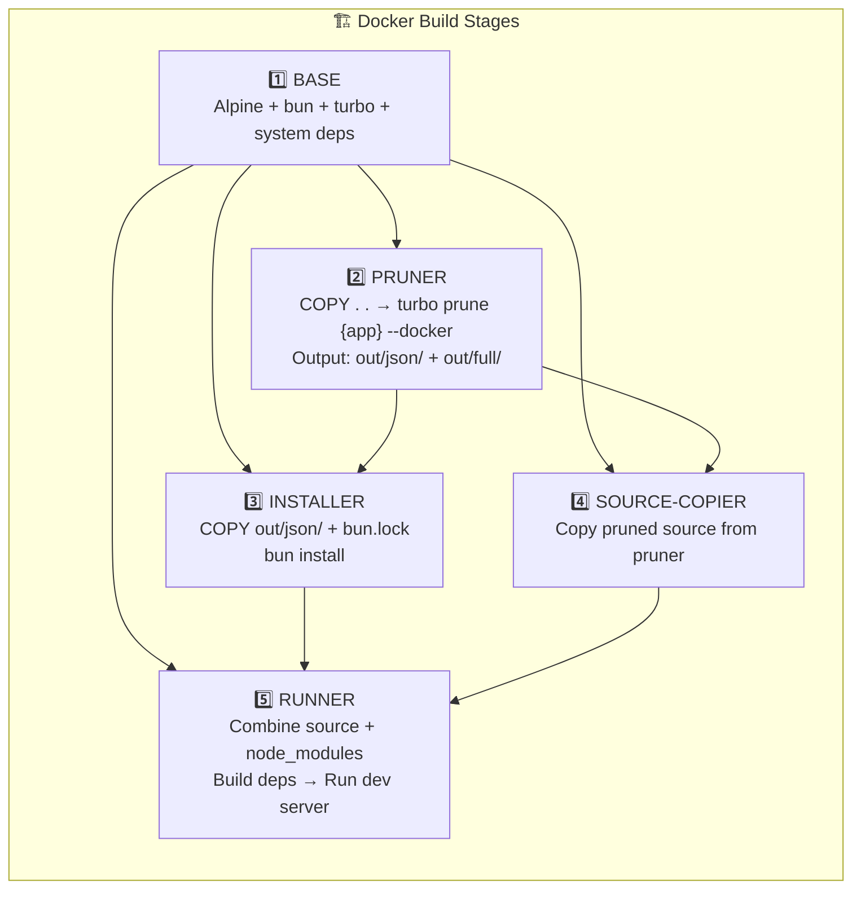

# Docker Builder AGENTS — Multi-Stage Build Architecture

This file documents the multi-stage Docker build architecture for this monorepo, designed to maximize layer caching and minimize rebuild times.

## Goals

1. **Maximize cache hits**: Source code changes should NOT invalidate `node_modules` installation
2. **Fast rebuilds**: Code-only changes should rebuild in ~10-20 seconds
3. **Preserve symlinks**: Bun/npm workspaces use symlinked `node_modules`
4. **Support postinstall**: Some packages (fumadocs) need config files during `bun install`

## Architecture Overview

All Dockerfiles follow a **5-stage architecture**:

```
BASE → PRUNER → INSTALLER → SOURCE-COPIER → RUNNER
```



## Stage Details

### Stage 1: BASE

Common system dependencies for all subsequent stages.

```dockerfile
FROM oven/bun:1.3.3-alpine AS base
RUN apk add --no-cache libc6-compat curl bash python3 make g++ gcc musl-dev tar
RUN --mount=type=cache,target=/root/.bun bun install -g turbo@^2
WORKDIR /app
```

**Caching**: ✅ Rarely invalidates (only on base image or system deps change)

---

### Stage 2: PRUNER

Uses `turbo prune --docker` to determine which workspaces are needed for the target app.

```dockerfile
FROM base AS pruner
WORKDIR /app
COPY . .
RUN bun x turbo prune {app} --docker
```

**Output structure:**
```
/app/out/
├── json/           # ONLY package.json files (for installer)
│   ├── package.json
│   ├── apps/web/package.json
│   └── packages/ui/package.json
├── full/           # Complete source (for source-copier)
│   ├── apps/web/src/...
│   └── packages/ui/src/...
└── bun.lock        # ⚠️ BUGGY - DO NOT USE (turborepo#10783)
```

**Caching**: ⚠️ Invalidates on ANY file change, but runs fast (~2-3s)

---

### Stage 3: INSTALLER

Installs dependencies using ONLY the pruned `package.json` structure.

```dockerfile
FROM base AS installer
WORKDIR /app

# Copy ONLY package.json files from pruner's out/json/
COPY --from=pruner /app/out/json/ .

# Use ORIGINAL bun.lock (not out/bun.lock which is buggy!)
COPY --from=pruner /app/bun.lock ./bun.lock

# Install with fallback (frozen-lockfile may fail on pruned structure)
RUN --mount=type=cache,target=/root/.bun \
    --mount=type=cache,target=/root/.cache \
    bun install --frozen-lockfile || bun install
```

**Key insight**: This stage only sees `out/json/` which contains **ONLY package.json files**. 
Source code changes don't affect this stage's cache!

**Caching**: ✅ Only invalidates when `package.json` or `bun.lock` changes

**Known bug workaround**: `turbo prune` generates a corrupted `out/bun.lock` 
(see [turborepo#10783](https://github.com/vercel/turborepo/issues/10783), [#11074](https://github.com/vercel/turborepo/issues/11074)).
We copy the **original** `bun.lock` from the pruner stage instead.

---

### Stage 4: SOURCE-COPIER

Copies the full pruned source code (without `node_modules`).

```dockerfile
FROM base AS source-copier
WORKDIR /app

COPY --from=pruner /app/out/json/ /tmp/prune-structure/

RUN --mount=type=bind,from=pruner,source=/app,target=/mnt/pruner \
    # Copy root config files
    cp /mnt/pruner/package.json /mnt/pruner/turbo.json /app/ && \
    cp /mnt/pruner/bun.lock* /app/ && \
    # Copy pruned apps
    for appPkg in $(find /tmp/prune-structure/apps -name "package.json"); do \
        appDir=$(dirname "$appPkg" | sed 's|/tmp/prune-structure/||'); \
        cp -r /mnt/pruner/$appDir/. /app/$appDir/; \
    done && \
    # Copy pruned packages
    for pkgJson in $(find /tmp/prune-structure/packages -name "package.json"); do \
        pkgDir=$(dirname "$pkgJson" | sed 's|/tmp/prune-structure/||'); \
        cp -r /mnt/pruner/$pkgDir/. /app/$pkgDir/; \
    done
```

**Caching**: ⚠️ Invalidates on source changes (expected, but fast ~1-2s)

---

### Stage 5: RUNNER

Combines source code + `node_modules` and runs the dev server.

```dockerfile
FROM base AS runner
WORKDIR /app

# Copy source from source-copier
COPY --from=source-copier /app/ .

# Copy node_modules via tar to preserve symlinks
RUN --mount=type=bind,from=installer,source=/app,target=/mnt/installer \
    cd /mnt/installer && tar cf - node_modules | tar xf - -C /app && \
    # Also copy nested node_modules in apps/ and packages/
    find /mnt/installer/apps -name node_modules -type d | while read dir; do \
        relDir=$(echo "$dir" | sed 's|/mnt/installer/||'); \
        cd /mnt/installer && tar cf - "$relDir" | tar xf - -C /app; \
    done && \
    find /mnt/installer/packages -name node_modules -type d | while read dir; do \
        relDir=$(echo "$dir" | sed 's|/mnt/installer/||'); \
        cd /mnt/installer && tar cf - "$relDir" | tar xf - -C /app; \
    done

# Build dependencies
RUN bun x turbo run build --filter={app}... --filter=!{app}

# Start dev server
CMD ["sh", "-c", "bun x turbo run dev --filter={app}..."]
```

**Why tar?** Bun workspaces use symlinks in `node_modules`. Regular `COPY` or `cp` breaks them.

**Caching**: ⚠️ Invalidates on source or dependency changes

---

## Cache Behavior by Change Type

### Scenario 1: Source Code Change (e.g., edit `src/app/page.tsx`)

| Stage | Status | Time |
|-------|--------|------|
| BASE | ✅ Cached | 0s |
| PRUNER | 🔄 Re-runs | ~2-3s |
| INSTALLER | ✅ **CACHED** | 0s |
| SOURCE-COPIER | 🔄 Re-runs | ~1-2s |
| RUNNER | 🔄 Re-runs | ~5-15s |

**Total: ~10-20 seconds** ⚡

### Scenario 2: Dependency Change (e.g., edit `package.json`)

| Stage | Status | Time |
|-------|--------|------|
| BASE | ✅ Cached | 0s |
| PRUNER | 🔄 Re-runs | ~2-3s |
| INSTALLER | 🔄 Re-runs | ~30-120s |
| SOURCE-COPIER | 🔄 Re-runs | ~1-2s |
| RUNNER | 🔄 Re-runs | ~10-30s |

**Total: ~60-180 seconds** 🐢

### Scenario 3: No Changes (rebuild)

| Stage | Status | Time |
|-------|--------|------|
| All stages | ✅ Cached | ~2-5s |

---

## Doc App Special Case: `source.config.ts`

The `doc` app uses **fumadocs** which runs a postinstall script that imports `source.config.ts`.
This means the installer stage needs this file to succeed.

**Doc Dockerfile difference:**

```dockerfile
# In INSTALLER stage (doc only):
COPY --from=pruner /app/out/json/ .
COPY --from=pruner /app/bun.lock ./bun.lock
# ⚠️ Doc-specific: fumadocs postinstall needs this file
COPY --from=pruner /app/apps/doc/source.config.ts ./apps/doc/source.config.ts
RUN bun install --frozen-lockfile || bun install
```

**Cache impact**: If you edit `source.config.ts`, the installer will re-run.
But this file rarely changes (it just defines content directories).

---

## Why Not Share Dockerfile Stages?

Docker does NOT support importing stages from external Dockerfiles. Each Dockerfile must be self-contained.

**Alternatives considered:**
1. **Single unified Dockerfile with ARGs** - Possible but complex
2. **Pre-built base image** - Requires separate build + registry
3. **Copy-paste stages** - Current approach, explicit and simple

---

## Recommendations

1. **Keep postinstall scripts minimal** - Only depend on small config files
2. **Don't edit `source.config.ts` frequently** - It invalidates doc's installer cache
3. **Use BuildKit cache mounts** - `--mount=type=cache,target=/root/.bun`
4. **Preserve symlinks with tar** - Never use plain `COPY` for `node_modules`
5. **Use original `bun.lock`** - The pruned one is buggy

---

## File Structure

```
docker/builder/
├── AGENTS.md                          # This file
├── api/
│   └── Dockerfile.api.dev             # API development build
├── doc/
│   └── Dockerfile.doc.dev             # Doc development build (has source.config.ts)
└── web/
    └── Dockerfile.web.dev             # Web development build
```

---

File: `docker/builder/AGENTS.md` — Documents the multi-stage Docker build architecture.
