# Documentation Analysis Scripts

This directory contains TypeScript scripts for analyzing and visualizing the documentation structure of this project.

## Prerequisites

These scripts require **Bun** runtime to be installed:
```bash
curl -fsSL https://bun.sh/install | bash
```

## 📚 Available Scripts

### 1. `check-doc-links.ts` - Link Analysis Tool

Analyzes markdown files for links and follows references recursively to understand documentation relationships.

#### Purpose
- Parse markdown files for internal links
- Follow link references to specified depth
- Identify broken or missing documentation links
- Generate relationship tree showing link structure
- Provide statistics on documentation connectivity

#### Usage

```bash
bun run docs/bin/check-doc-links.ts --file <path> [--depth <number>] [--filter <pattern>]
```

#### Options

| Option | Required | Default | Description |
|--------|----------|---------|-------------|
| `--file <path>` | ✅ Yes | - | Path to the markdown file to analyze |
| `--depth <number>` | ❌ No | 1 | Recursion depth for following links |
| `--filter <pattern>` | ❌ No | `*.md` | File pattern to filter results |
| `-h, --help` | ❌ No | - | Show help message |

#### Examples

```bash
# Analyze single file (depth 1)
bun run docs/bin/check-doc-links.ts --file docs/README.md

# Follow links 2 levels deep
bun run docs/bin/check-doc-links.ts --file docs/README.md --depth 2

# Filter specific patterns
bun run docs/bin/check-doc-links.ts --file docs/README.md --filter "ARCHITECTURE*.md"

# Analyze from root copilot instructions
bun run docs/bin/check-doc-links.ts --file .github/copilot-instructions.md --depth 3
```

#### Output Format

The script outputs:
1. **Header**: File being analyzed, depth, and filter settings
2. **Link Tree**: Hierarchical tree showing all linked files with indentation
3. **Statistics**: 
   - Total files analyzed
   - Total links found
   - Broken links count
   - Unique files visited

**Example Output:**
```
=== Documentation Link Analysis ===
File: /path/to/docs/README.md
Depth: 2
Filter: *.md

=== Link Tree ===
📄 README.md
  → 44 link(s)
    📄 architecture/ARCHITECTURE.md
      → 5 link(s)
        📄 CORE-MODULE-ARCHITECTURE.md
        📄 SERVICE-CONTEXT-ARCHITECTURE.md
        ...
    📄 guides/GETTING-STARTED.md
      → 3 link(s)
        ...

=== Statistics ===
Total files analyzed: 45
Total links found: 104
Broken links: 0
Unique files visited: 45
```

#### Exit Codes

- `0`: Success, no broken links found
- `1`: Error or broken links detected

---

### 2. `generate-doc-diagram.ts` - Mermaid Diagram Generator

Generates Mermaid flowchart visualization of documentation structure and interconnections.

#### Purpose
- Create visual representation of documentation relationships
- Generate Mermaid flowchart code showing all links
- Color-code by documentation category
- Provide legend for easy understanding
- Enable quick overview of documentation structure

#### Usage

```bash
bun run docs/bin/generate-doc-diagram.ts [--start <path>] [--depth <number>]
```

#### Options

| Option | Required | Default | Description |
|--------|----------|---------|-------------|
| `--start <path>` | ❌ No | `.github/copilot-instructions.md` | Starting documentation file |
| `--depth <number>` | ❌ No | unlimited | Maximum recursion depth |
| `-h, --help` | ❌ No | - | Show help message |

#### Examples

```bash
# Full documentation diagram from copilot instructions
bun run docs/bin/generate-doc-diagram.ts

# Start from main docs README
bun run docs/bin/generate-doc-diagram.ts --start docs/README.md

# Limited depth for overview (2 levels)
bun run docs/bin/generate-doc-diagram.ts --start docs/README.md --depth 2

# Save to file
bun run docs/bin/generate-doc-diagram.ts --start docs/README.md > doc-structure.mermaid
```

#### Output Format

The script generates valid Mermaid flowchart code:

```mermaid
flowchart TD
  %% Documentation Structure Diagram
  %% Generated by: generate-doc-diagram.sh
  
  node0["docs/README.md"]
  style node0 stroke-width:3px
  node0 --> node1
  node1["docs/core-concepts/README.md"]
  style node1 fill:#fee,stroke:#f33,stroke-width:2px
  
  %% ... more nodes
  
  %% Legend
  legend["📚 Legend"]
  legend --> core["🔴 Core Concepts"]
  style core fill:#fee,stroke:#f33,stroke-width:2px
  legend --> arch["🔵 Architecture"]
  style arch fill:#eef,stroke:#33f,stroke-width:2px
  %% ... more legend items
```



#### Color Coding

| Documentation Type | Color | Description |
|-------------------|-------|-------------|
| 🔴 Core Concepts | Red fill | `docs/core-concepts/` - Mandatory patterns |
| 🔵 Architecture | Blue fill | `docs/architecture/` - System design |
| 🟢 Guides | Green fill | `docs/guides/` - How-to documentation |
| 🟡 Planning | Yellow fill | `docs/planning/` - Roadmaps and TODOs |
| 🟣 Specifications | Purple fill | `docs/specifications/` - Technical specs |
| 🟠 Features | Orange fill | `docs/features/` - Feature-specific docs |
| ⚪ README files | Bold stroke | Any `README.md` file |
| ⬜ Default | White fill | Other documentation files |

#### Using Generated Diagrams

**Option 1: GitHub Markdown** (Renders Automatically)
```markdown
```mermaid
[paste generated code here]
```
```

**Option 2: Mermaid Live Editor**
- Visit [mermaid.live](https://mermaid.live)
- Paste generated code
- Export as PNG/SVG

**Option 3: VS Code**
- Install "Markdown Preview Mermaid Support" extension
- Paste code in `.md` file
- Preview renders diagram

---

## 🎯 Common Use Cases

### 1. Understanding Documentation Structure

```bash
# See high-level documentation organization
bun run docs/bin/generate-doc-diagram.ts --start docs/README.md --depth 1
```

### 2. Finding Broken Links

```bash
# Check all links from main README
bun run docs/bin/check-doc-links.ts --file docs/README.md --depth 3
```

### 3. Visualizing Documentation Flow

```bash
# Generate complete diagram from copilot instructions
bun run docs/bin/generate-doc-diagram.ts > docs/architecture/DOC-STRUCTURE.mermaid
```

### 4. Analyzing Specific Documentation Areas

```bash
# Check only architecture documentation links
bun run docs/bin/check-doc-links.ts --file docs/architecture/ARCHITECTURE.md --depth 2

# Generate diagram for core concepts only
bun run docs/bin/generate-doc-diagram.ts --start docs/core-concepts/README.md --depth 2
```

### 5. Documentation Maintenance

```bash
# Find all broken links across entire documentation
bun run docs/bin/check-doc-links.ts --file docs/README.md --depth 10

# Verify new documentation is properly linked
bun run docs/bin/check-doc-links.ts --file docs/new-feature/README.md
```

---

## 🔧 Technical Details

### Dependencies

Both scripts require:
- **Bun**: JavaScript/TypeScript runtime (install: `curl -fsSL https://bun.sh/install | bash`)
- **Node.js modules**: `fs`, `path` (built-in with Bun)

### Script Location

Scripts are located in `/docs/bin/` relative to project root:
```
docs/
├── bin/
│   ├── check-doc-links.ts
│   ├── generate-doc-diagram.ts
│   └── README.md (this file)
├── core-concepts/
├── architecture/
└── ...
```

### Execution Requirements

Scripts are executable with Bun shebang:
```typescript
#!/usr/bin/env bun
```

Run directly:
```bash
bun run docs/bin/check-doc-links.ts --file docs/README.md
```

### Link Extraction Logic

The scripts use regex pattern to extract markdown links:
```typescript
/\[([^\]]+)\]\(([^)]+)\)/g
```

**Pre-processing Steps**:
1. **Code Block Removal**: Triple backtick code blocks (` ``` `) are removed before link extraction to avoid processing example links in documentation
2. **Example Link Detection**: Links prefixed with `<!-- example -->` comment are skipped

This matches:
- <!-- example --> `[Link Text](path/to/file.md)` - Standard markdown links
- <!-- example --> `[Link Text](path/to/file.md#anchor)` - Links with anchors
- <!-- example --> `[Link Text](../relative/path.md)` - Relative paths

**Example Links (Skipped from Validation)**:
Links prefixed with `<!-- example -->` comment are skipped during validation:
```markdown
<!-- example --> [Example Link](./EXAMPLE-FILE.md)
```
This is useful for documentation that shows link structure examples without pointing to real files.

**Code Blocks (Automatically Skipped)**:
All links inside triple backtick code blocks are automatically skipped:
```markdown
\`\`\`markdown
<!-- example --> [Example Link](./EXAMPLE-FILE.md)
\`\`\`
```
This prevents examples in code blocks from being validated.

Excluded from analysis:
- External links (`http://`, `https://`, `mailto:`, etc.)
- Anchor-only links (`#section` within same file)
- Non-markdown files (unless explicitly filtered)
- Example links with `<!-- example -->` prefix
- Links inside code blocks (triple backticks)

### Path Resolution

Both scripts:
1. Resolve relative paths from the source file's directory using Node.js `path` module
2. Normalize paths to absolute paths with `path.resolve()`
3. Handle `..` (parent directory) references automatically
4. Verify file existence before processing with `fs.existsSync()`

---

## 📊 Integration with README-First Pattern

These scripts support the **README-First Documentation Discovery** pattern (see [core-concepts/06-README-FIRST-DOCUMENTATION-DISCOVERY.md](../core-concepts/06-README-FIRST-DOCUMENTATION-DISCOVERY.md)):

1. **Start with `docs/README.md`**:
   ```bash
   bun run docs/bin/generate-doc-diagram.ts --start docs/README.md
   ```

2. **Navigate via subdirectory structure**:
   - Use diagram to understand subdirectory organization
   - Check subdirectory READMEs for detailed navigation

3. **Verify documentation hierarchy**:
   ```bash
   bun run docs/bin/check-doc-links.ts --file docs/README.md --depth 2
   ```

4. **Understand relationships before deep-diving**:
   - Generate diagram first to see structure
   - Then read individual files following README hierarchy

---

## 🛠️ Troubleshooting

### "Bun not found" Error

**Problem**: Bun runtime not installed

**Solution**: Install Bun:
```bash
curl -fsSL https://bun.sh/install | bash
```

### "Permission denied" Error

**Problem**: Scripts are not executable

**Solution**:
```bash
chmod +x docs/bin/*.ts
```

Or use `bun run` directly:
```bash
bun run docs/bin/check-doc-links.ts --file docs/README.md
```

### "File not found" Errors

**Problem**: Relative path resolution failed

**Solution**: Use absolute paths or run from project root:
```bash
# From project root
bun run docs/bin/check-doc-links.ts --file docs/README.md

# Or use absolute path
bun run docs/bin/check-doc-links.ts --file /full/path/to/docs/README.md
```

### Mermaid Diagram Not Rendering

**Problem**: Generated code has syntax errors

**Solution**: 
1. Verify output with [mermaid.live](https://mermaid.live)
2. Check for special characters in file names
3. Ensure proper escaping in node labels
4. TypeScript version handles this automatically with proper sanitization

---

## 📝 Examples Gallery

### Example 1: Full Project Documentation Map

```bash
bun run docs/bin/generate-doc-diagram.ts --start .github/copilot-instructions.md
```

**Output**: Complete Mermaid diagram showing how copilot instructions link to all core concepts, documentation, and guides.

### Example 2: Core Concepts Link Check

```bash
bun run docs/bin/check-doc-links.ts --file docs/core-concepts/README.md --depth 2
```

**Output**: 
```
=== Documentation Link Analysis ===
File: /path/to/docs/core-concepts/README.md
Depth: 2
Filter: *.md

=== Link Tree ===
📄 core-concepts/README.md
  → 9 link(s)
    📄 00-EFFICIENT-EXECUTION-PROTOCOL.md
      (no links)
    📄 01-DOCUMENTATION-FIRST-WORKFLOW.md
      → 1 link(s)
        📄 ../README.md
    ...

=== Statistics ===
Total files analyzed: 10
Total links found: 15
Broken links: 0
Unique files visited: 10
```

### Example 3: Architecture Documentation Diagram

```bash
bun run docs/bin/generate-doc-diagram.ts --start docs/architecture/ARCHITECTURE.md --depth 2
```

**Output**: Mermaid diagram showing architecture documentation relationships with blue-colored nodes.

---

## 🚀 Future Enhancements

Potential improvements for these scripts:

- [ ] HTML output format (in addition to Mermaid)
- [ ] JSON export of link structure
- [ ] Interactive CLI with menu selection
- [ ] Automatic broken link fixing suggestions
- [ ] Integration with CI/CD for link validation
- [ ] Documentation coverage reports
- [ ] Link usage statistics and analytics

---

## 📚 Related Documentation

- [Core Concept: README-First Documentation Discovery](../core-concepts/06-README-FIRST-DOCUMENTATION-DISCOVERY.md)
- [Documentation Home](../README.md)
- [Copilot Workflow Diagram](../core-concepts/COPILOT-WORKFLOW-DIAGRAM.md)

---

**Last Updated**: 2025-10-14  
**Maintainer**: Project Team  
**Status**: ✅ Active
