📍 [Documentation Hub](../README.md) > [Core Concepts](./README.md) > Documentation Maintenance Protocol

# Documentation Maintenance Protocol

> **Type**: Core Concept - Process & Workflow  
> **Priority**: 🔴 CRITICAL  
> **Last Updated**: 2025-10-14

## Overview

Documentation is a **FIRST-CLASS CITIZEN** in this project. Every documentation update MUST follow a strict maintenance protocol to ensure the documentation remains accurate, complete, and properly indexed.

**⚠️ This protocol is MANDATORY for all documentation changes**

## Core Principle

**Every documentation update triggers a cascading update protocol:**
1. Update or create the documentation file
2. Update the parent README.md to reference it
3. Validate all links using `docs/bin/check-doc-links.ts`
4. Update the main docs/README.md if needed (for new categories or major changes)

**No documentation update is complete until all four steps are done.**

## The Documentation Maintenance Flow

```mermaid
flowchart TD
    Start([📝 Documentation Update Needed]) --> CheckType{What Type of Update?}
    
    CheckType -->|New File| CreateFile[📄 Create Documentation File]
    CheckType -->|Modify Existing| ModifyFile[✏️ Modify Documentation File]
    CheckType -->|New Folder| CreateFolder[📁 Create New Folder]
    
    CreateFile --> CheckParentREADME{Parent README<br/>Exists?}
    ModifyFile --> CheckParentREADME
    
    CreateFolder --> CreateFolderREADME[📄 Create README.md<br/>in New Folder]
    CreateFolderREADME --> CheckParentREADME
    
    CheckParentREADME -->|Yes| UpdateParentREADME[📝 Update Parent README.md<br/>Add Reference to New/Changed File]
    CheckParentREADME -->|No| CreateParentREADME[📄 Create Parent README.md<br/>with Index Structure]
    
    CreateParentREADME --> UpdateParentREADME
    
    UpdateParentREADME --> ValidateLinks[✅ Validate Links Using<br/>check-doc-links.ts]
    
    ValidateLinks --> LinksValid{All Links Valid?}
    
    LinksValid -->|No| FixBrokenLinks[🔧 Fix Broken Links]
    FixBrokenLinks --> ValidateLinks
    
    LinksValid -->|Yes| CheckMainREADME{Major Category<br/>or Structure Change?}
    
    CheckMainREADME -->|Yes| UpdateMainREADME[📝 Update docs/README.md<br/>Main Documentation Hub]
    CheckMainREADME -->|No| Complete
    
    UpdateMainREADME --> Complete([✅ Documentation Update Complete])
    
    style Start fill:#e1f5fe
    style Complete fill:#a5d6a7
    style ValidateLinks fill:#fff9c4
    style LinksValid fill:#ffebee
    style CheckParentREADME fill:#f3e5f5
```



## Step-by-Step Protocol

### Step 1: Update or Create Documentation File

**When creating a new file:**
```bash
# Follow naming conventions
docs/<category>/<DESCRIPTIVE-NAME>.md

# Examples:
docs/core-concepts/11-NEW-CORE-CONCEPT.md
docs/guides/NEW-FEATURE-GUIDE.md
docs/specifications/API-VERSIONING-SPEC.md
```

**Required sections in new documentation:**
```markdown
# Document Title

> **Type**: [Core Concept/Guide/Specification/Architecture/etc.]
> **Priority**: [🔴 CRITICAL / 🟡 IMPORTANT / 🟢 REFERENCE]
> **Last Updated**: YYYY-MM-DD

## Overview
[Brief description]

## [Main Content Sections]
...

## Related Documentation
- <!-- example --> [Link to related docs](./RELATED-DOC.md)

---

**Last Updated**: YYYY-MM-DD
**Maintainer**: [Team/Person]
**Status**: [✅ Active / 🔄 In Progress / 🚧 Draft]
```

### Step 2: Update Parent README.md

**MANDATORY: Every folder MUST have a README.md serving as an index**

#### Option A: Parent README Already Exists

Update the parent README to reference the new/changed file:

```markdown
# [Category Name]

## Overview
[Description of this category]

## Documents in This Category

### [Subcategory 1]
- <!-- example --> [Existing Doc 1](./EXISTING-DOC-1.md) - Description
- <!-- example --> [Existing Doc 2](./EXISTING-DOC-2.md) - Description
- **<!-- example --> [NEW DOC](./NEW-DOC.md) - Description** ← ADD THIS

### [Subcategory 2]
...
```

**Index Table Format** (for core-concepts and similar):
```markdown
| File | Concept | Priority | Description |
|------|---------|----------|-------------|
| [NEW-FILE.md](./NEW-FILE.md) | New Concept | 🔴 CRITICAL | Brief description |
```

**Note**: For example links in documentation that don't point to real files, prefix the link with `<!-- example -->` comment:
```markdown
<!-- example --> [Example Doc](./EXAMPLE-FILE.md)
```
This tells the link checker to skip validation for these example links.

#### Option B: Parent README Does NOT Exist

**Create a new README.md in the parent folder:**

```markdown
# [Category Name]

> **Category**: [Description]
> **Last Updated**: YYYY-MM-DD

## Overview

[Brief description of what this category contains and its purpose]

## Documents in This Category

### <!-- example --> [Document 1](./DOCUMENT-1.md)
[Description of what this document covers]

### <!-- example --> [Document 2](./DOCUMENT-2.md)
[Description of what this document covers]

## Navigation

- **Up**: [Parent README](../README.md) ← Link back to parent
- **Related Categories**:
  - <!-- example --> [Related Category 1](../related-category/README.md)
  - <!-- example --> [Related Category 2](../related-category-2/README.md)

---

**Last Updated**: YYYY-MM-DD
**Maintainer**: Project Team
```

### Step 3: Validate Links with check-doc-links.ts

**MANDATORY: Run link validation after EVERY documentation update**

```bash
# Validate links from the updated/created file
```bash
# Example command - path/to/file.md is just a placeholder
bun run docs/bin/check-doc-links.ts --file docs/path/to/file.md
```

# Validate links from parent README
bun run docs/bin/check-doc-links.ts --file docs/path/to/README.md --depth 2

# For major changes, validate entire documentation structure
bun run docs/bin/check-doc-links.ts --file docs/README.md --depth 3
```

**Check for broken links in output:**
```
=== Statistics ===
Total files analyzed: 45
Total links found: 104
Broken links: 0  ← MUST BE ZERO
Unique files visited: 45
```

**If broken links found:**
1. Fix broken links by correcting file paths
2. Re-run validation
3. Repeat until `Broken links: 0`

### Step 4: Update Main docs/README.md (When Needed)

**Update the main documentation hub when:**
- Creating a new **category** (new subdirectory)
- Adding a new **major section** to existing category
- Changing **documentation structure** or organization
- Adding **new documentation type** (e.g., new specifications category)

**How to update docs/README.md:**

```markdown
## 📚 Documentation Structure

### 🎯 [Category Name]
- **[Existing Category](./related-category/README.md)** - Existing description
- <!-- example --> **[New Subcategory](./category/subcategory/README.md)** ← ADD HERE
- **[Another Category](./related-category-2/README.md)** - Another description
- Existing subcategories...

### 🔧 [Existing Category]
...
```

**Or update the Quick Reference table:**

```markdown
## 🔍 Quick Reference

| Task | Documentation File | Key Section |
|------|-------------------|-------------|
| Task description | `docs/existing/file.md` | Section Name |
| <!-- example --> New task description | `docs/category/NEW-FILE.md` | Section Name | ← ADD HERE
| Existing tasks... | ... | ... |
```

## New Folder Creation Protocol

**When creating a new documentation folder:**

### Step 1: Create the Folder
```bash
mkdir -p docs/new-category
```

### Step 2: Create README.md in New Folder
```markdown
# [New Category Name]

> **Category**: [Brief description]
> **Last Updated**: YYYY-MM-DD

## Overview

[Detailed description of this category's purpose and what it contains]

## Documents in This Category

*(Currently empty - documents will be added here)*

## Related Categories

- <!-- example --> [Related Category 1](../related-category/README.md)
- <!-- example --> [Related Category 2](../related-category-2/README.md)

## Navigation

- **Up**: [Main Documentation](../README.md)

---

**Last Updated**: YYYY-MM-DD
**Maintainer**: Project Team
```

### Step 3: Update Parent README (docs/README.md)

Add the new category to the main documentation hub:

```markdown
## 📚 Documentation Structure

### 🎯 Core Concepts
...

### 🆕 <!-- example --> [New Category Name](./new-category/README.md) ← ADD THIS SECTION
Brief description of what this category covers.

**Key Documents:**
- (Will be added as category grows)
```

### Step 4: Validate Links
```bash
bun run docs/bin/check-doc-links.ts --file docs/README.md --depth 2
```

## Reading Documentation Protocol

**When AI needs to read documentation, follow README-First pattern:**

### Protocol for Documentation Discovery

1. **ALWAYS start with docs/README.md** (main hub)
2. **Navigate via subdirectory structure** shown in main README
3. **Check subdirectory READMEs** before reading individual files
4. **Use check-doc-links.ts** to understand relationships:
   ```bash
   bun run docs/bin/check-doc-links.ts --file docs/README.md --depth 2
   ```
5. **Read specific files** only after understanding structure

### Using check-doc-links.ts for Reading

```bash
# Understand documentation structure from a file
bun run docs/bin/check-doc-links.ts --file docs/category/README.md --depth 2

# See what a file links to (its dependencies)
bun run docs/bin/check-doc-links.ts --file docs/category/SPECIFIC-DOC.md --depth 1

# Trace complete documentation tree
bun run docs/bin/check-doc-links.ts --file docs/README.md --depth 3 --verbose
```

**Link tree shows reading order:**
```
📄 docs/README.md
  → 44 link(s)
    📄 docs/core-concepts/README.md  ← Read this first
      → 9 link(s)
        📄 00-EFFICIENT-EXECUTION-PROTOCOL.md  ← Then these
        📄 01-DOCUMENTATION-FIRST-WORKFLOW.md
        ...
    📄 docs/guides/GETTING-STARTED.md  ← Then this
      → 3 link(s)
        ...
```

## Enforcement Rules

### 🔴 CRITICAL Rules (MUST FOLLOW)

1. **NEVER create documentation without updating parent README**
2. **ALWAYS validate links after documentation changes**
3. **ALWAYS create README.md for new folders**
4. **ALWAYS update docs/README.md for new categories**
5. **ALWAYS use check-doc-links.ts to validate**

### ✅ Required Actions

**For Every Documentation Update:**
- [ ] Create or modify documentation file
- [ ] Update parent README.md (or create if missing)
- [ ] Run `bun run docs/bin/check-doc-links.ts --file [FILE] --depth 2`
- [ ] Fix any broken links (repeat validation until clean)
- [ ] Update docs/README.md if new category or major change

**For New Folders:**
- [ ] Create folder structure
- [ ] Create README.md in new folder with index
- [ ] Update parent README.md to reference new folder
- [ ] Validate links from parent README
- [ ] Update docs/README.md with new category

### ❌ Common Violations

**DO NOT:**
- ❌ Create documentation files without updating parent README
- ❌ Leave broken links in documentation
- ❌ Create folders without README.md
- ❌ Skip link validation after changes
- ❌ Update documentation without running check-doc-links.ts
- ❌ Add new categories without updating docs/README.md

## Tools Reference

### check-doc-links.ts

**Purpose**: Validate all links in documentation are correct and not broken

**Usage:**
```bash
# Basic usage - check single file
bun run docs/bin/check-doc-links.ts --file docs/path/to/file.md

# Follow links deeper (2 levels)
bun run docs/bin/check-doc-links.ts --file docs/README.md --depth 2

# Verbose output with link counts
bun run docs/bin/check-doc-links.ts --file docs/README.md --depth 2 --verbose

# Filter specific file patterns
bun run docs/bin/check-doc-links.ts --file docs/README.md --filter "*.md"
```

**Exit Codes:**
- `0` = Success, no broken links
- `1` = Broken links found or error

**What it checks:**
- ✅ All markdown links `[text](path)` 
- ✅ Relative path resolution
- ✅ File existence validation
- ✅ Link relationship tree
- ✅ Statistics and broken link count

### generate-doc-diagram.ts

**Purpose**: Visualize documentation structure with Mermaid diagrams

**Usage:**
```bash
# Generate diagram from docs/README.md
bun run docs/bin/generate-doc-diagram.ts --start docs/README.md

# Full diagram from copilot instructions
bun run docs/bin/generate-doc-diagram.ts

# Limited depth diagram
bun run docs/bin/generate-doc-diagram.ts --start docs/README.md --depth 2
```

**Use for:**
- Understanding documentation structure
- Visualizing link relationships
- Creating documentation maps
- Seeing category organization

## Examples

### Example 1: Creating New Core Concept

```bash
# 1. Create the file
cat > docs/core-concepts/11-NEW-PATTERN.md << 'EOF'
# New Pattern

> **Type**: Core Concept - Architecture
> **Priority**: 🔴 CRITICAL
> **Last Updated**: 2025-10-14

## Overview
...
EOF

# 2. Update parent README (docs/core-concepts/README.md)
# Add to the index table:
# | <!-- example --> [11-NEW-PATTERN.md](./11-NEW-PATTERN.md) | New Pattern | 🔴 CRITICAL | Description |

# 3. Validate links
bun run docs/bin/check-doc-links.ts --file docs/core-concepts/README.md --depth 2

# 4. Update docs/README.md if this is a major addition
# (Usually not needed for single core concept additions)
```

### Example 2: Creating New Documentation Category

```bash
# 1. Create new folder with README
mkdir -p docs/new-category
cat > docs/new-category/README.md << 'EOF'
# New Category

> **Category**: Description
> **Last Updated**: 2025-10-14

## Overview
...
EOF

# 2. Add first document
cat > docs/new-category/FIRST-DOC.md << 'EOF'
# First Document
...
EOF

# 3. Update new-category/README.md to reference FIRST-DOC.md
# Remember to use <!-- example --> for example links if showing documentation structure

# 4. Update docs/README.md to add new category

# 5. Validate all links
bun run docs/bin/check-doc-links.ts --file docs/new-category/README.md --depth 2
bun run docs/bin/check-doc-links.ts --file docs/README.md --depth 2
```

### Example 3: Modifying Existing Documentation

```bash
# 1. Edit the file
vim docs/guides/EXISTING-GUIDE.md

# 2. Check if parent README needs update (if file name or purpose changed)
# Update docs/guides/README.md if needed

# 3. Validate links (especially if added new links in the file)
bun run docs/bin/check-doc-links.ts --file docs/guides/EXISTING-GUIDE.md --depth 2

# 4. Validate parent README
bun run docs/bin/check-doc-links.ts --file docs/guides/README.md --depth 2

# 5. Fix any broken links if found
# 6. Re-run validation until clean
```

## Integration with Other Core Concepts

This protocol works in conjunction with:

- **[01-DOCUMENTATION-FIRST-WORKFLOW.md](./01-DOCUMENTATION-FIRST-WORKFLOW.md)**: Read docs before implementing
- **[06-README-FIRST-DOCUMENTATION-DISCOVERY.md](./06-README-FIRST-DOCUMENTATION-DISCOVERY.md)**: Navigate via README hierarchy
- **[00-EFFICIENT-EXECUTION-PROTOCOL.md](./00-EFFICIENT-EXECUTION-PROTOCOL.md)**: Silent execution, batch actions

## Validation Checklist

Before marking documentation work as complete:

- [ ] Documentation file created or modified with proper structure
- [ ] Parent README.md updated with reference to new/changed file
- [ ] `check-doc-links.ts` run on modified file (0 broken links)
- [ ] `check-doc-links.ts` run on parent README (0 broken links)
- [ ] New folders have README.md with index structure
- [ ] docs/README.md updated if new category added
- [ ] All related documentation links validated
- [ ] No broken links in entire documentation tree

## Related Core Concepts

- [01-DOCUMENTATION-FIRST-WORKFLOW.md](./01-DOCUMENTATION-FIRST-WORKFLOW.md) - Read docs before implementing
- [06-README-FIRST-DOCUMENTATION-DISCOVERY.md](./06-README-FIRST-DOCUMENTATION-DISCOVERY.md) - README-first navigation pattern
- [00-EFFICIENT-EXECUTION-PROTOCOL.md](./00-EFFICIENT-EXECUTION-PROTOCOL.md) - Efficient execution principles

## Related Tools

- [docs/bin/check-doc-links.ts](../../docs/bin/check-doc-links.ts) - Link validation tool
- [docs/bin/generate-doc-diagram.ts](../../docs/bin/generate-doc-diagram.ts) - Diagram generation tool
- [docs/bin/README.md](../../docs/bin/README.md) - Documentation tools guide

---

**Last Updated**: 2025-10-14  
**Enforcement**: 🔴 CRITICAL - MUST be followed for ALL documentation changes  
**Status**: ✅ Active
