# Type Safety Flow in ORPC Hooks Generator

## Complete Type Safety Chain

```mermaid
graph TD
    A[Zod Entity Schema] -->|Type Inference| B[standard Factory]
    B -->|Creates| C[StandardOperations]
    C -->|Generates| D[RouteBuilder Contracts]
    D -->|With Metadata| E[Router Configuration]
    E -->|Input to| F[createRouterHooks]
    F -->|Generates| G[Typed React Query Hooks]
    
    D -.->|"__orpc_route_builder_method__"| F
    C -.->|HTTP Method| D
    D -.->|HTTP Method| F
    F -.->|GET → useQuery| G
    F -.->|POST/PUT/DELETE → useMutation| G
    
    style A fill:#e1f5ff
    style G fill:#e1ffe1
    style F fill:#ffe1e1
    style D fill:#fff5e1
```



## Example Flow

```typescript
// Step 1: Define Schema (Type Source)
const userSchema = z.object({
  id: z.string(),
  name: z.string(),
  email: z.string(),
});
// Type: ZodObject<{ id: ZodString, name: ZodString, email: ZodString }>

// Step 2: Create Standard Operations
const userOps = standard.zod(userSchema, 'user');
// Type: StandardOperations<typeof userSchema>

// Step 3: Build Contracts
const listContract = userOps.list().build();
// Type: Contract<{
//   input: { limit?: number, offset?: number, ... },
//   output: { data: User[], meta: {...} }
// }>

// Step 4: Create Router
const userRouter = {
  list: listContract,
  // ... other contracts
};

// Step 5: Generate Hooks
const hooks = createRouterHooks(userRouter);
// Type: {
//   useList: (input?: ListInput) => UseQueryResult<ListOutput>,
//   useCreate: () => UseMutationResult<User, unknown, CreateInput>,
//   // ... fully typed hooks
// }

// Step 6: Use in Components (Full Type Safety!)
function UserList() {
  const { data } = hooks.useList({ limit: 20 });
  //     ^? data: { data: User[], meta: {...} } | undefined
  
  return data?.data.map(user => (
    //            ^? user: User
    <div key={user.id}>{user.name}</div>
    //        ^? id: string  ^? name: string
  ));
}
```

## Type Safety Guarantees

### 1. Input Type Safety
```typescript
hooks.useList({ 
  limit: 20,      // ✅ Valid
  // invalid: 123 // ❌ TypeScript error
});
```

### 2. Output Type Safety
```typescript
const { data } = hooks.useList();
data?.data       // ✅ Type: User[]
data?.meta       // ✅ Type: { pagination: {...}, sorting: {...} }
// data?.invalid // ❌ TypeScript error
```

### 3. Mutation Type Safety
```typescript
const { mutate } = hooks.useCreate();
mutate({ 
  name: "John",   // ✅ Valid
  email: "john@example.com", // ✅ Valid
  // invalid: 123 // ❌ TypeScript error
});
```

### 4. Cache Invalidation Type Safety
```typescript
defineInvalidations(router, {
  create: ['list', 'count'],     // ✅ Valid procedure names
  // create: ['invalid'],        // ❌ TypeScript error
  
  update: (input) => ({
    //     ^? input: UpdateInput (fully typed)
    findById: { id: input.id },  // ✅ Typed reference
  }),
});
```

## HTTP Method to Hook Type Mapping


## Standard Operations Type Map

| Operation | Method | Input Type | Output Type | Hook Type |
|-----------|--------|------------|-------------|-----------|
| `list()` | GET | `{ limit?, offset?, sort?, filter? }` | `{ data: Entity[], meta }` | Query |
| `read()` | GET | `{ id: string }` | `Entity \| null` | Query |
| `count()` | GET | `{ filter? }` | `{ count: number }` | Query |
| `check()` | GET | `{ [field]: value }` | `{ exists: boolean }` | Query |
| `create()` | POST | `Partial<Entity>` | `Entity` | Mutation |
| `update()` | PUT | `Entity` | `Entity` | Mutation |
| `patch()` | PATCH | `Partial<Entity> & { id }` | `Entity` | Mutation |
| `delete()` | DELETE | `{ id: string }` | `{ success: boolean }` | Mutation |

## Metadata Flow

```typescript
// RouteBuilder adds metadata during contract creation
const contract = RouteBuilder
  .create()
  .method('GET')  // HTTP method stored in metadata
  .path('/users')
  .build();

// Metadata structure
contract['~orpc'] = {
  meta: {
    __orpc_route_builder_method__: {
      method: 'GET',  // ← This determines hook type
      path: '/users',
    }
  }
};

// Hook generator reads metadata
function detectOperationType(contract) {
  const method = contract['~orpc']?.meta?.[ROUTE_METHOD_META_KEY]?.method;
  return method === 'GET' ? 'query' : 'mutation';
}
```

## Type Inference Chain

```typescript
// 1. Schema defines structure
type User = z.infer<typeof userSchema>;
// { id: string, name: string, email: string }

// 2. StandardOperations inherits entity type
StandardOperations<typeof userSchema>
// All operations know about User type

// 3. Contracts inherit from operations
listContract: Contract<{
  input: ListInput<User>,
  output: ListOutput<User>
}>

// 4. Hooks inherit from contracts
useList: (input?: ListInput<User>) => 
  UseQueryResult<ListOutput<User>>

// 5. Components get full type safety
const { data } = useList();
//     ^? data: ListOutput<User> | undefined
```

## Conclusion

The type safety flow is **completely unbroken** from schema definition to component usage:

1. ✅ Zod schema defines entity structure
2. ✅ `standard()` infers types from schema
3. ✅ Operations generate typed contracts
4. ✅ RouteBuilder preserves types with metadata
5. ✅ Hook generator reads metadata and preserves types
6. ✅ React components receive fully typed hooks
7. ✅ TypeScript catches all type errors at compile time

**No type casting, no `any`, no type loss!** 🎉
